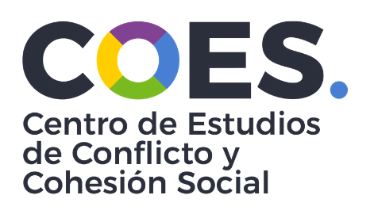
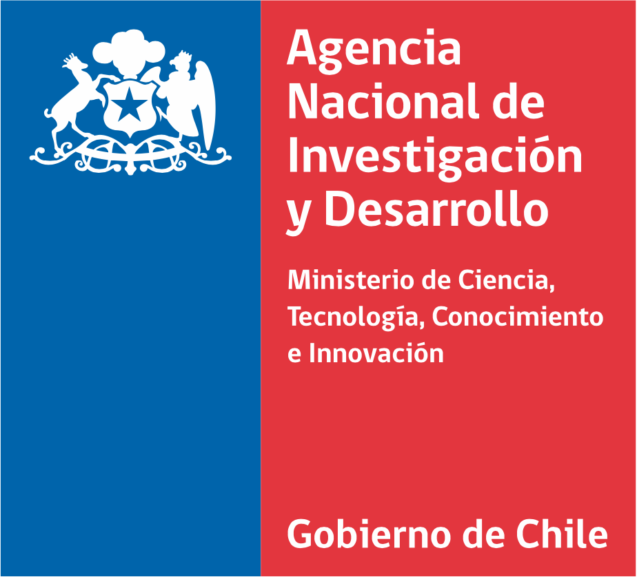
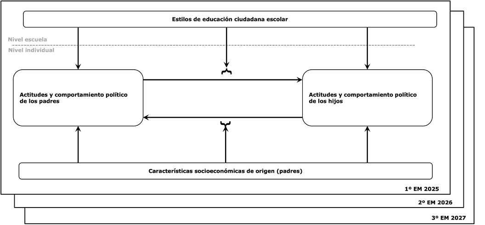
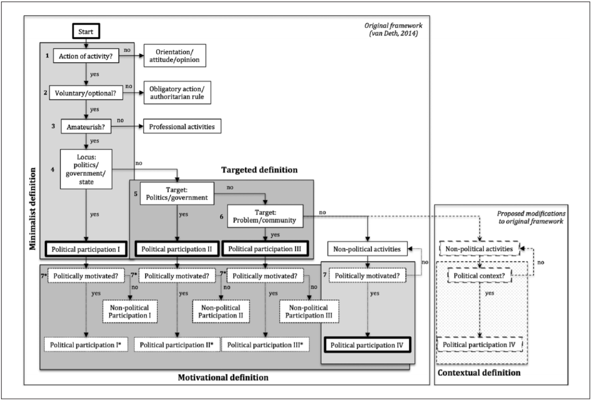
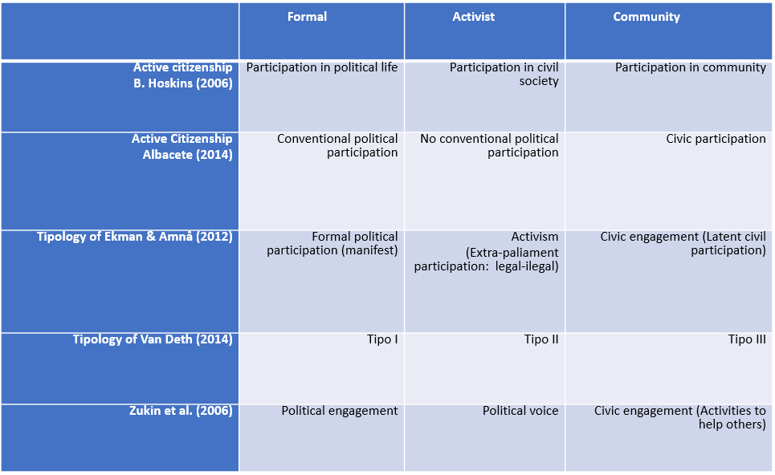
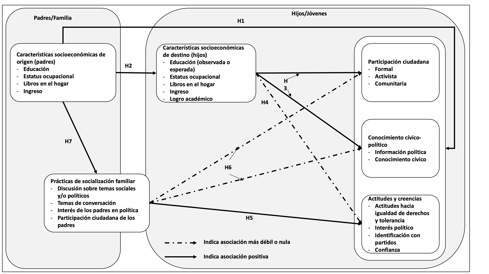
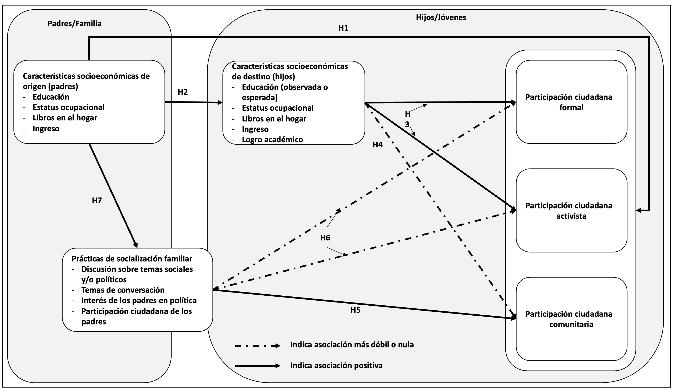
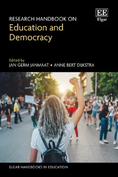
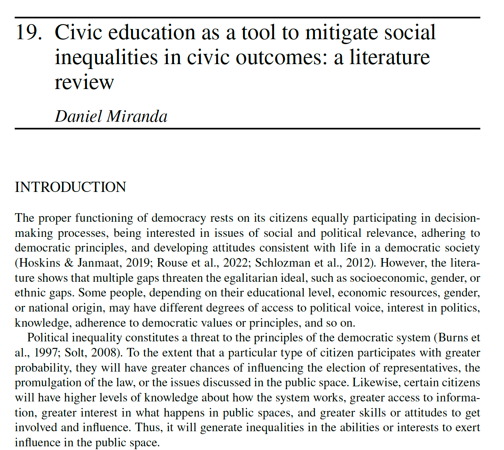

```{r}
#| label: setup
#| include: false
library(knitr)
knitr::opts_chunk$set(#echo = F,
                      warning = F,
                      error = F, 
                      message = F,
                      cache=T) 
```

::: columns
::: {.column width="15%"}





 1240922
:::

::: {.column .column-right width="85%"}
<br>

## **Socialización política juvenil: participación, creencias, actitudes y conocimiento**

------------------------------------------------------------------------

Daniel Miranda

::: {.blue .medium}
Contacto: danmiranda\@uchile.cl
:::

2026
:::
:::

# Contenidos

## Contenidos

-   Marco de investigación
-   Conceptos relevantes
-   Rol de la familia
-   Rol de la escuela

# Marco de la Investigación

## Proyecto 1240922

Título: Actitudes y comportamiento político juvenil: desigualdad, estilos de socialización escolar e influencias intergeneracionales

FONDECYT regular 1240922

Periodo: 2024-2028

Equipo: Paula Luengo-Kanacri (UC), Felipe Sanchez-Barría (UC), Nicolás Angelcos (UChile), Yonatan Encina (UTalca), Daniel Miranda (UChile).

## Objetivos

Objetivo general:

Describir y examinar distintos procesos de socialización política a nivel familiar-escolar y cómo estos influyen en el desarrollo de las actitudes y comportamiento político.

Objetivos específicos:

• Describir la estabilidad o cambios de la influencia de procesos de socialización política familiar sobre distintos tipos de comportamiento y actitudes políticas de los jóvenes a lo largo de la enseñanza media.

## Objetivos

Objetivos específicos:

• Describir y examinar la influencia de características sociopolíticas de los jóvenes sobre el comportamiento y actitudes políticas de sus padres/madres/cuidadores-as.

• Describir los estilos de socialización política a nivel familiar y escolar examinando su influencia sobre distintos tipos de comportamientos políticos de los jóvenes.

• Describir y examinar las diferencias en los procesos de socialización política familiar y escolar, según distintas condiciones socioeconómicas.

## Modelo general



# Conceptos relevantes

## Democracia y ciudadanía

-   *"..las monocracias, las autocracias, las dictaduras son fáciles, nos caen encima solas; las democracias son difíciles, tienen que ser promovidas y creídas" (Sartori, 1991, p.118)*.

## Modelo(s) de democracia

-   Modelo(s) de democracia: liberal
-   Modelo(s) de democracia: Republicanismo cívico
-   Modelo(s) de democracia: Democracia crítica
-   Modelo(s) de democracia: Democracia cosmopolita

# Modelo(s) de ciudadanía: ¿Crisis o nuevas ciudadanías?

## Modelos posibles

-   "participation in civil society, community and/or political life, characterized by mutual respect and non-violence and in accordance with human rights and democracy" (2006¸ pp. 4).

-   Sociedad civil

-   Comunidad

-   Vida política

-   Respeto mutuo

-   no violencia

-   derechos humanos

-   democracia

## Modelo(s) de ciudadanía

{fig-align="center"}

## Modelo(s) de ciudadanía

{fig-align="center"}

## Jóvenes y participación

-   Paradoja de la participación, sobre todo en cohortes más jóvenes

-   Disminución de la participación en voto como amenaza a la representatividad de los sistemas democráticos (Blais & Rubenson, 2013).

## Jóvenes y participación

-   Desigualad política: otra amenaza.

-   Desigualdad Social y su relación con desigualdad política

-   Aumento de las desigualdades sociales (Picketty, 2014; GINI project, 2012).

-   Los efectos de los sesgo socieconómicos se observan desde edades tempranas, indicando desigualdad política desde el inicio (Verba, Burns & Schlozman, 2003; 2015)

-   Estos sesgos socioeconómicos serían una amenaza importante a los ideales democráticos de igualdad en la participación y representación.

# Rol de la familia

## Rol de la familia

{fig-align="center"}

## Rol de la familia

{fig-align="center"}

# Rol de la escuela

## Rol de la escuela

-   Socialización política: Entender el proceso por medio del cuál las personas de encuentran su lugar en el sistema político es (y han sido) un tema de preocupación (Tockeville; Niemi & Hepburn, 1995; Greenstein, 1965; Hyman, 1969; Langton, 1969; Abendschon, 2013; Ekman & Amna, 2014)

-   Supuesto: Lo que se aprende en edades tempranas tiende a permanencer: persistencia de la socializaciión (Hooghe, 2004)

-   Agentes de socialización: Familia, escuela, pares, medios, instituciones.

-   La escuela...

## Ideales

Los sistemas escolares nacen atados a dos ideales normativos (Peña, 2014)

-   Meritocracia: escuela como ecualizador de las condiciones de origen social

-   Ciudadanía: separación de la incondicionalidad del hogar, permitiría la adquisicion de virtudes y valores necesarios para la vida democrática.

-   ¿Puede la escuela fortalecer esos ideales?

## Algunas evidencias

::: columns
::: {.column width="50%"}
{fig-align="center" width="50%"}
:::

::: {.column width="50%"}

:::
:::

## 

::: columns
::: {.column width="15%"}


:::

::: {.column .column-right width="85%"}
<br>

## **Socialización política juvenil: participación, creencias, actitudes y conocimiento**

------------------------------------------------------------------------

Daniel Miranda

::: {.blue .medium}
Contacto: danmiranda\@uchile.cl
:::

2026
:::
:::
