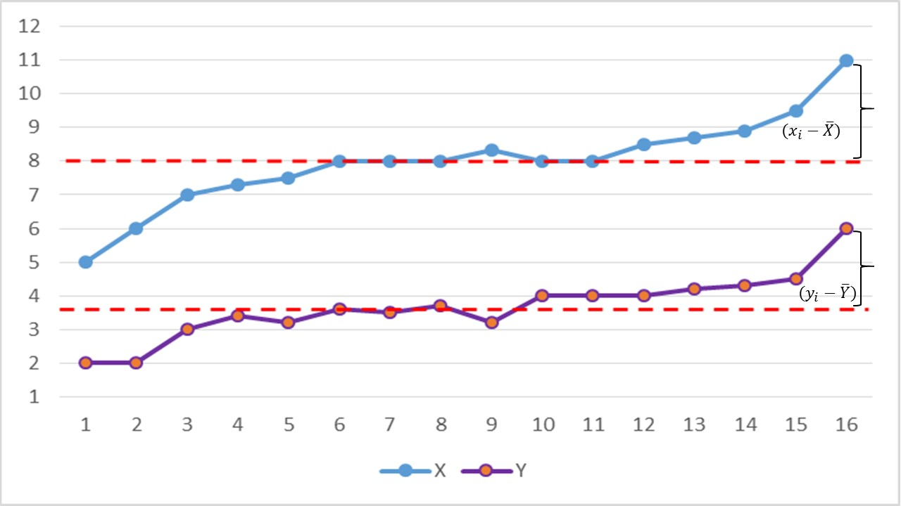
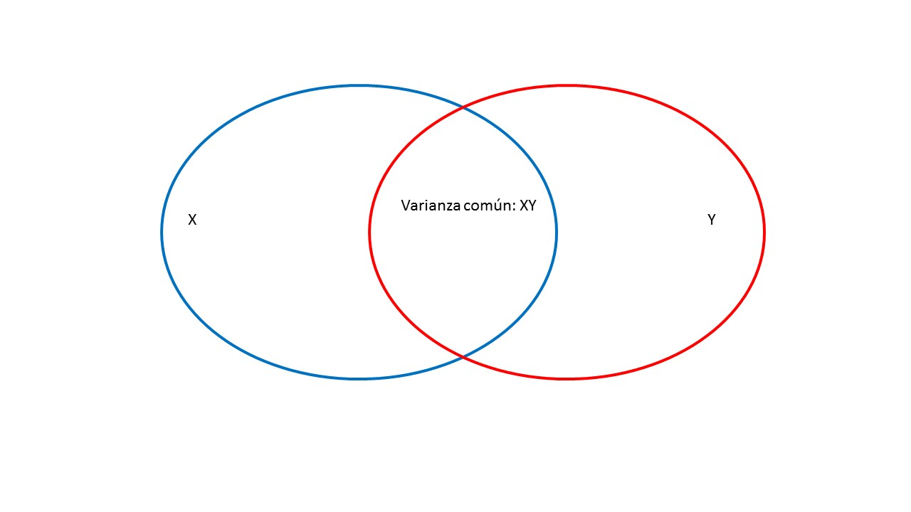
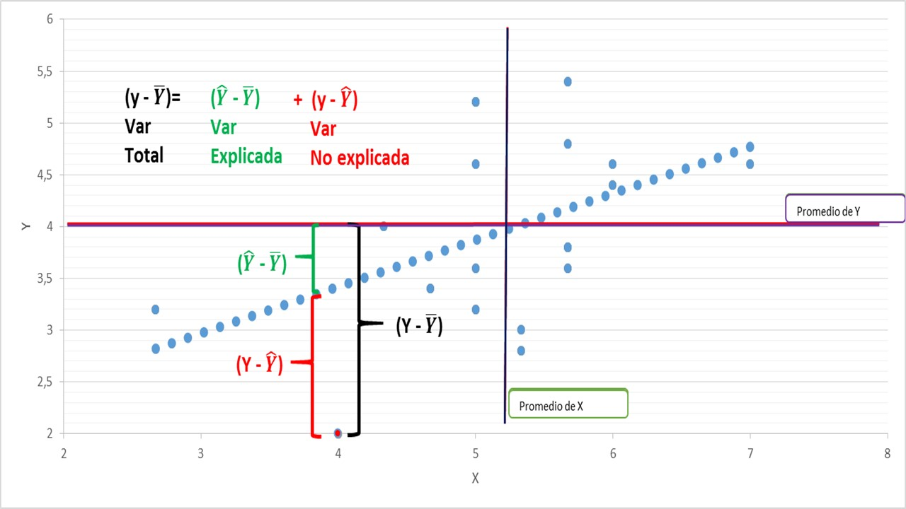

## Las medidas de asociación:

-   Evalúan la variación conjunta de dos variables.

-   Según los niveles de medición, podemos distinguir distintos tipos de medidas de asociación.

|                |                     |              |                |
|----------------|---------------------|--------------|----------------|
|                | **Intervalar**      | **Ordinal**  | **Nominal**    |
| **Intervalar** | Correlación Pearson | Anova        | T-test / Anova |
| **Ordinal**    | Anova               | Chi-cuadrado | Chi-cuadrado   |
| **Nominal**    | T-test / Anova      | Chi-cuadrado | Chi-cuadrado   |

## Las medidas de asociación:

Considerando la correlación como la medida de asociación principal, existen varios coeficientes de correlación, según el niveles de medición.

-   $r_{Pearson}$ es la versión paramétrica. Asume variables continuas y normalidad.

-   $r_{Spearman}$ es una versión no paramétrica. Se usa para variables ordinales.

-   $r_{PointBiserial}$ y $r_{biserial}$ cuantifican la relación entre una variable continua y dicotómica.

-   $r_{policóricas}$ es una alternativa que permite diferentes niveles de medición entre las variables (p.e. cuadracóricas, tetracóricas, policóricas)

## Correlación

¿Cómo evaluar la relación entre dos variables con un niveles de medición continuo?

Por ejemplo, la relación entre el atractivo de confederadas y el comportamieto de los participantes. Un estudio realizado por Roney, Mahler y Maestripieri(2003), testeó la relación entre estas dos variables:

**Roney, J. R., Mahler, S. V., and Maestripieri, D. (2003). Behavioral and hormonal responses of men to brief interactions with women. Evolution and Human Behavior, 24, 365-375.**

## Correlación

-   Para evaluar esta relación:

-   Se midió el nivel de atractivo de las confederadas del estudio

-   Se evaluó el comportamiento de los participantes hacia las confederadas (Intención de agradar, llamar la atención, etc.)

## Correlación

-   ¿Cómo evaluar si hay asociación entre éstas dos variables?

```{=html}
<style scoped>
table {
  font-size: 13px;
}
</style>
```
| **atractivo (X)** | **comportamiento (Y)** |
|:-----------------:|:----------------------:|
|       2,67        |          3,2           |
|         4         |           2            |
|       4,33        |           4            |
|       4,67        |          3,4           |
|         5         |          3,2           |
|         5         |          3,6           |
|         5         |          5,2           |
|         5         |          5,2           |
|         5         |          4,6           |
|       5,33        |          2,8           |
|       5,33        |           3            |
|       5,67        |          5,4           |
|       5,67        |          4,8           |
|       5,67        |          3,8           |
|       5,67        |          3,6           |
|       5,67        |          3,8           |
|         6         |          4,6           |
|         6         |          4,4           |
|         7         |          4,6           |
|                   |                        |
|  $\bar{Y}=5,19$   |     $\bar{X}=3,96$     |

## Correlación

-   La forma más simple de ver si dos variables estan asociadas, es ver si pesentan variación conjunta, es decir **covarían**. Eso nos remite primero al concepto de **varianza**.

-   La varianza, como medida de dispersión, es una representación de cuanto varía un set de datos respecto de su promedio.

$\sigma^2 = \frac{\sum(x_i - \bar{x})^2} {n} = \frac{\sum(x_i - \bar{x})*(x_i - \bar{x})} {n}$

-   Por otro lado, en sentido de la variación conjunta de dos variables, se espera que cuando una variable se desvía de su promedio la otra se desvíe de su promedio de una forma similar (Field y Miles, 2014).

## Correlación

Por ejemplo, una forma de representar esto puede ser la siguiente:



## Correlación

Otra forma de visualizar la variación conjunta es generando un gráfico de puntos (scatterplot). Por ejemplo, si usamos los datos del ejemplo mencionado, se observa una tendencia.

```{r}
xatrac=c(2.67,4,4.33,4.67,5,5,5,5,5,5.33,5.33,5.67,5.67,5.67,5.67,5.67,6,6,7)
ycomp=c(3.2,2,4,3.4,3.2,3.6,5.2,5.2,4.6,2.8,3,5.4,4.8,3.8,3.6,3.8,4.6,4.4,4.6)
miles=data.frame(xatrac,ycomp)
```

## Correlación

```{r}
library(ggplot2)
scatterm<-ggplot(miles, aes(xatrac,ycomp))

scatterm + geom_point(size = 4) + labs(x = "Atractivo", y = "Comportamiento") + scale_y_continuous(limits=c(2, 6), breaks=c(2:6)) + scale_x_continuous(limits=c(2, 7), breaks=c(2:7))
```

## Varianza y covarianza

-   Varianza

$\sigma^2 = \frac{\sum(x_i - \bar{x})^2} {n} = \frac{\sum(x_i - \bar{x})*(x_i - \bar{x})} {n}$

-   Covarianza

$Cov(x,y) = \frac{\sum(x_i - \bar{x})*(y_i - \bar{y})} {n-1}$

-   ¿Qué tienen en común las formulas de $\sigma^2$ y cov?

Suma de productos de desviación.

## Varianza y covarianza

```{=html}
<style scoped>
table {
  font-size: 13px;
}
</style>
```
| atr(X)         | comp(Y)        | $(X-\bar{X})$ | $(Y-\bar{Y})$ | $(X-\bar{X})^2$ | $(Y-\bar{Y}^2$  | $(X-\bar{X})*(Y-\bar{Y})$ |
|----------|----------|----------|----------|----------|----------|----------|
| 2,67           | 3,2            | -2,52         | -0,76         | 6,35            | 0,58            | 1,92                      |
| 4              | 2              | -1,19         | -1,96         | 1,42            | 3,84            | 2,33                      |
| 4,33           | 4              | -0,86         | 0,04          | 0,74            | 0,00            | -0,03                     |
| 4,67           | 3,4            | -0,52         | -0,56         | 0,27            | 0,31            | 0,29                      |
| 5              | 3,2            | -0,19         | -0,76         | 0,04            | 0,58            | 0,14                      |
| 5              | 3,6            | -0,19         | -0,36         | 0,04            | 0,13            | 0,07                      |
| 5              | 5,2            | -0,19         | 1,24          | 0,04            | 1,54            | -0,24                     |
| 5              | 5,2            | -0,19         | 1,24          | 0,04            | 1,54            | -0,24                     |
| 5              | 4,6            | -0,19         | 0,64          | 0,04            | 0,41            | -0,12                     |
| 5,33           | 2,8            | 0,14          | -1,16         | 0,02            | 1,35            | -0,16                     |
| 5,33           | 3              | 0,14          | -0,96         | 0,02            | 0,92            | -0,13                     |
| 5,67           | 5,4            | 0,48          | 1,44          | 0,23            | 2,07            | 0,69                      |
| 5,67           | 4,8            | 0,48          | 0,84          | 0,23            | 0,71            | 0,40                      |
| 5,67           | 3,8            | 0,48          | -0,16         | 0,23            | 0,03            | -0,08                     |
| 5,67           | 3,6            | 0,48          | -0,36         | 0,23            | 0,13            | -0,17                     |
| 5,67           | 3,8            | 0,48          | -0,16         | 0,23            | 0,03            | -0,08                     |
| 6              | 4,6            | 0,81          | 0,64          | 0,66            | 0,41            | 0,52                      |
| 6              | 4,4            | 0,81          | 0,44          | 0,66            | 0,19            | 0,36                      |
| 7              | 4,6            | 1,81          | 0,64          | 3,28            | 0,41            | 1,16                      |
| $\bar{X}=5,19$ | $\bar{Y}=3,96$ |               |               | $\sum=14,7$     | $\sum=15,17$    | $\sum(x,y)=6,63$          |
|                |                |               |               | $\sigma^2=0,82$ | $\sigma^2=0,84$ | $cov(x,y)=$               |

## Covarianza

```{=html}
<style scoped>
table {
  font-size: 13px;
}
</style>
```
| atr(X)         | comp(Y)        | (X-$\bar{X}$) | (Y-$\bar{Y}$) | (X-$\bar{X}$)2  | (Y-$\bar{Y}$)2  | (X-$\bar{X}$)\*(Y-$\bar{Y}$) \\ |
|----------|----------|----------|----------|----------|----------|----------|
| 2,67           | 3,2            | -2,52         | -0,76         | 6,35            | 0,58            | 1,92                            |
| 4              | 2              | -1,19         | -1,96         | 1,42            | 3,84            | 2,33                            |
| 4,33           | 4              | -0,86         | 0,04          | 0,74            | 0,00            | -0,03                           |
| 4,67           | 3,4            | -0,52         | -0,56         | 0,27            | 0,31            | 0,29                            |
| 5              | 3,2            | -0,19         | -0,76         | 0,04            | 0,58            | 0,14                            |
| 5              | 3,6            | -0,19         | -0,36         | 0,04            | 0,13            | 0,07                            |
| 5              | 5,2            | -0,19         | 1,24          | 0,04            | 1,54            | -0,24                           |
| 5              | 5,2            | -0,19         | 1,24          | 0,04            | 1,54            | -0,24                           |
| 5              | 4,6            | -0,19         | 0,64          | 0,04            | 0,41            | -0,12                           |
| 5,33           | 2,8            | 0,14          | -1,16         | 0,02            | 1,35            | -0,16                           |
| 5,33           | 3              | 0,14          | -0,96         | 0,02            | 0,92            | -0,13                           |
| 5,67           | 5,4            | 0,48          | 1,44          | 0,23            | 2,07            | 0,69                            |
| 5,67           | 4,8            | 0,48          | 0,84          | 0,23            | 0,71            | 0,40                            |
| 5,67           | 3,8            | 0,48          | -0,16         | 0,23            | 0,03            | -0,08                           |
| 5,67           | 3,6            | 0,48          | -0,36         | 0,23            | 0,13            | -0,17                           |
| 5,67           | 3,8            | 0,48          | -0,16         | 0,23            | 0,03            | -0,08                           |
| 6              | 4,6            | 0,81          | 0,64          | 0,66            | 0,41            | 0,52                            |
| 6              | 4,4            | 0,81          | 0,44          | 0,66            | 0,19            | 0,36                            |
| 7              | 4,6            | 1,81          | 0,64          | 3,28            | 0,41            | 1,16                            |
| $\bar{X}$=5,19 | $\bar{Y}$=3,96 | 0             | 0             | $\sum=14,7$     | $\sum=15,17$    | $\sum(x,y)=6,63$                |
|                |                |               |               | $\sigma^2=0,82$ | $\sigma^2=0,84$ | $cov(x,y)=0,37$                 |

## Covarianza

-   Una primera medida de asociación a considerar es **la suma de productos de desviación**

$\sum(x_i - \bar{x})*(y_i - \bar{y})$

$(x_i - \bar{x})*(y_i - \bar{y})=(-2,52)*(-0,76)=1,92$

-   Una segunda medida de asociación a considerar es **la covarianza**

$Cov(x,y) = \frac{\sum(x_i - \bar{x})*(y_i - \bar{y})} {n-1}$

$Cov(x,y) = \frac{6,63} {18}=0,37$

-   ¿Qué nos indica?

## Covarianza

Intuitivamente podemos interpretar este indicador según el sentido de la variación conjunta($\sum(x,y)=6,63$):

$- *-= +$

$+ * + =+$

$-*+=-$

$+*- =-$

## Correlación de Pearson

Correlación de Pearson (producto-momento de Pearson).

```{=html}
<style scoped>
table {
  font-size: 13px;
}
</style>
```
| atr(X)         | comp(Y)        | $(X-\bar{X})$ | $(Y-\bar{Y})$ | $(X-\bar{X})2$  | $(Y-\bar{Y})2$  | $(X-\bar{X})*(Y-\bar{Y})$ |
|----------|----------|----------|----------|----------|----------|----------|
| 2,67           | 3,2            | -2,52         | -0,76         | 6,35            | 0,58            | 1,92                      |
| 4              | 2              | -1,19         | -1,96         | 1,42            | 3,84            | 2,33                      |
| 4,33           | 4              | -0,86         | 0,04          | 0,74            | 0,00            | -0,03                     |
| 4,67           | 3,4            | -0,52         | -0,56         | 0,27            | 0,31            | 0,29                      |
| 5              | 3,2            | -0,19         | -0,76         | 0,04            | 0,58            | 0,14                      |
| 5              | 3,6            | -0,19         | -0,36         | 0,04            | 0,13            | 0,07                      |
| 5              | 5,2            | -0,19         | 1,24          | 0,04            | 1,54            | -0,24                     |
| 5              | 5,2            | -0,19         | 1,24          | 0,04            | 1,54            | -0,24                     |
| 5              | 4,6            | -0,19         | 0,64          | 0,04            | 0,41            | -0,12                     |
| 5,33           | 2,8            | 0,14          | -1,16         | 0,02            | 1,35            | -0,16                     |
| 5,33           | 3              | 0,14          | -0,96         | 0,02            | 0,92            | -0,13                     |
| 5,67           | 5,4            | 0,48          | 1,44          | 0,23            | 2,07            | 0,69                      |
| 5,67           | 4,8            | 0,48          | 0,84          | 0,23            | 0,71            | 0,40                      |
| 5,67           | 3,8            | 0,48          | -0,16         | 0,23            | 0,03            | -0,08                     |
| 5,67           | 3,6            | 0,48          | -0,36         | 0,23            | 0,13            | -0,17                     |
| 5,67           | 3,8            | 0,48          | -0,16         | 0,23            | 0,03            | -0,08                     |
| 6              | 4,6            | 0,81          | 0,64          | 0,66            | 0,41            | 0,52                      |
| 6              | 4,4            | 0,81          | 0,44          | 0,66            | 0,19            | 0,36                      |
| 7              | 4,6            | 1,81          | 0,64          | 3,28            | 0,41            | 1,16                      |
| $\bar{X}=5,19$ | $\bar{Y}=3,96$ | 0             | 0             | $\sum=14,7$     | $\sum=15,17$    | $\sum(x,y)=6,63$          |
|                |                |               |               | $\sigma^2=0,82$ | $\sigma^2=0,84$ | $cov(x,y)=0,37$           |
|                |                |               |               | $\sigma=0,90$   | $\sigma=0,92$   | $r(x,y) =0,44$            |

## Correlación

Una tercera medida de asociación a considerar es **la correlación de pearson**

$r(X,Y) = \frac{{Cov}(X,Y)}{\sqrt{{Var}(X){Var}(Y)}}$

$r(x,y) = \frac{0,37}{\sqrt{0,82*0,84}}=0,44$

-   Puede ser considerada como una estadarización de la covarianza.

## Otro camino para el mismo resultado.

$r(x,y) = \frac{\frac{\sum(x_i - \bar{x})*(y_i - \bar{y})}{n-1}}{{\sqrt{\frac{\sum(x_i - \bar{x})^2}{n-1}}}*{\sqrt{\frac{\sum(y_i - \bar{y})^2}{n-1}}}}$

El factor común n-1 se remueve

$r(x,y) = \frac{\sum(x_i - \bar{x})*(y_i - \bar{y})}{{\sqrt{\sum(x_i - \bar{x})^2}}*{\sqrt{\sum(y_i - \bar{y})^2}}}$

$r(x,y) = \frac{6,63} {\sqrt{14,7*15,17}}=0,44$

## Correlación

Cada una de estas medidas aporta información sobre la asociación entre dos variables:

-   ¿Dirección de la asociación?

-   ¿Magnitud o grado de la asociación?

Para el caso de la correlación de Person:

-   Grado de asociación, independiente de la escala de las variables.

-   Expresada en escala estadarizada (-1 a 1)

-   Captura la relación líneal entre variables

-   ¿Significancia estadística? 

## Algunas consideraciones: Diferentes datos, misma correlación

```{r, echo=TRUE}
x=c(10,8,13,9,11,14,6,4,12,7,5)
x2=c(8,8,8,8,8,8,8,19,8,8,8)
y1=c(8.04,6.95,7.58,8.81,8.33,9.96,7.24,4.26,10.84,4.82,5.68)
y2=c(9.14,8.14,8.74,8.77,9.26,8.1,6.13,3.1,9.13,7.26,4.74)
y3=c(7.46,6.77,12.74,7.11,7.81,8.84,6.08,5.39,8.15,6.42,5.73)
y4=c(6.58,5.76,7.71,8.84,8.47,7.04,5.25,12.5,5.56,7.91,6.89)
ej1=data.frame(x,x2,y1, y2, y3, y4)
library(Hmisc)
library(kableExtra)
kable(ej1)
```

## Algunas consideraciones: Diferentes datos, misma correlación

```{r}
kable(cor(ej1))
```

## Algunas consideraciones: Diferentes datos, misma correlación

```{r}
cor(x,y1)
```

## Algunas consideraciones: Diferentes datos, misma correlación

```{r}
library(ggplot2)
scatter<-ggplot(ej1, aes(x,y1))
scatter + geom_point(size = 4) + labs(x = "x", y = "y1") + scale_y_continuous(limits=c(0, 12), breaks=c(1:12)) + scale_x_continuous(limits=c(1, 12), breaks=c(1:12))
```

## Algunas consideraciones: Diferentes datos, misma correlación

```{r}
scatter<-ggplot(ej1, aes(x,y2))
scatter + geom_point(size = 4) + labs(x = "x", y = "y2") + scale_y_continuous(limits=c(0, 12), breaks=c(1:12)) + scale_x_continuous(limits=c(1, 12), breaks=c(1:12))
```

## Algunas consideraciones: Diferentes datos, misma correlación

```{r}
scatter<-ggplot(ej1, aes(x,y3))
scatter + geom_point(size = 4) + labs(x = "x", y = "y3") + scale_y_continuous(limits=c(0, 12), breaks=c(1:12)) + scale_x_continuous(limits=c(1, 12), breaks=c(1:12))
```

## Algunas consideraciones: Diferentes datos, misma correlación

```{r}
scatter<-ggplot(ej1, aes(x,y4))
scatter + geom_point(size = 4) + labs(x = "x", y = "y4") + scale_y_continuous(limits=c(0, 12), breaks=c(1:12)) + scale_x_continuous(limits=c(1, 12), breaks=c(1:12))
```

## La importancia la exploración gráfica

```{r}
library(datasauRus)
library(dplyr)
datasaurus_dozen %>% 
    group_by(dataset) %>% 
    summarize(
      mean_x    = mean(x),
      mean_y    = mean(y),
      std_dev_x = sd(x),
      std_dev_y = sd(y),
      corr_x_y  = cor(x, y)
    )
```

## La importancia la exploración gráfica

```{r}
library(ggplot2)
  ggplot(datasauRus::datasaurus_dozen, aes(x = x, y = y, colour = dataset))+
    geom_point()+
    theme_void()+
    theme(legend.position = "none")+
    facet_wrap(~dataset, ncol = 3)
```

## Correlación

El índice de correlación puede ser entendido como un indicador de varianza compartida:

-   $r^2 \_{xy}$ Proporción de la varianza que comparten dos variables

{fig-align="center" width="100%"}

## Significancia de una correlación.

-   Una aproximación, puede ser calcular el valor t asociado al índice, con n-2 grados de libertad.

-   $t_r=\frac{r\sqrt{n-2}}{\sqrt{1-r^2}}$

Donde el $r^2=0.20$ es la varianza compartida.

-   $t_r=\frac{0.44\sqrt{19-2}}{\sqrt{1-0.20}}=2.1$

-   La probabilidad asociada a $t_r=2.1;gl=17;p=0.059$

-   ¿Qué pasa si modificamos el N?

## Significancia de una correlación.

-   Una aproximación, puede ser calcular el valor t asociado al índice, con n-2 grados de libertad.

-   $t_r=\frac{r\sqrt{n-2}}{\sqrt{1-r^2}}$

Donde el $r^2=0.20$ es la varianza compartida.

-   $t_r=\frac{0.44\sqrt{30-2}}{\sqrt{1-0.20}}=2.1$

-   La probabilidad asociada a $t_r=2.60;gl=28;p=0.014$

-   ¿Qué pasa si modificamos el N?

## En resumen:

-   La covarianza es una medida simple de asociación entre dos variables

-   El resultado de la estandarización de la covarianza es el coeficiente de correlación de Pearson.

-   Este coeficiente varía entre -1 a +1

## En resumen:

-   Un coeficiente de 1 indica una asociación lineal positiva perfecta, un coeficiente de -1 indica una asociación lineal negativa perfecta y un coeficiente de 0 indica que NO hay una relación líneal.

-   Un criterio para evaluar el tamaño de la correlación propuesto por Cohen es: +-0.1 representa una asociación pequeña, +-0.3 representa una asociación mediana y +-0.5 representa una asociación grande.

## Sin embargo,

-   Una correlación indica sólo asociación entre variables. No es posible identificar que variable predice la otra (Fields, 2014).

-   Además, se presenta el problema de la variable omitida.

# Modelo de Regresión líneal

## Regresión líneal

-   Se define como: $Y_i = \beta_0 + \beta_1 X_{i1} + \ldots + \beta_K X_{iK} + \epsilon_{i}$

donde $Y$ es la variable dependiente, las $X_1 \ldots X_K$ son las variables independientes, y $\epsilon$ es el componente aleatorio.

-   El parámetro $\beta_0$ es el intercepto, mientras que $\beta_K$ es el coeficiente de regresión parcial asociado a la variable $X_k$.

## Modelo de Regresión líneal

-   Esto es, $\beta_k$ mide cuanto cambia, en promedio, $Y$ ante el cambio de una unidad de $X_k$, manteniendo constantes todas los valores de las demás variables independientes.

-   Esta interpretación del "efecto marginal" se vuelve más compleja cuando hay interacciones.

-   La estimación de los parámetros $\beta_k$ y $\sigma^2$ se realiza vía MICO o ML (con el supuesto paramétrico de normalidad).

## Modelo de regresión Lineal

-   Si tomamos el valor esperado de $Y$ tenemos:

$E(Y_i) = E(\beta_0 + \beta_1 X_{i1} + \ldots + \beta_K X_{iK} + \epsilon_{i})$

$= \beta_0 + \beta_1 X_{i1} + \ldots + \beta_K X_{iK}$

-   Es decir, el modelo de regresión nos entrega el valor esperado de $Y$ condicionada a los valores dados de las $X_k$.

-   Como señala Gelman y Hill, la regresión lineal es un método que resume cómo los valores esperados de una variable numerica varían entre sub-grupos de una población definidas por medio de funciones lineales de los predictores.

## Supuestos de regresión Lineal

**Linealidad**:

-   La variable $Y$ es esta asociada linealmente a las variables $X_k$ por medio de los parémetros $\beta_k$.

-   Se permiten relaciones no lineales por medio de transformaciones matemáticas de las variables.

## Supuestos de regresión Lineal

**Colinealidad**:

-   Las variables dentro de la matriz $\mathbf{X}$ son linealmente independientes.
-   Técnicamente, ninguna $X_k$ es un combinación lineal de las otras $X_k$.
-   Esto no implica que las distintas $X_k$ no puedan estar correlacionadas o asociadas en forma no-lineal.

## Supuestos de regresión Lineal

**El valor esperado de los residuos, dado las** $X_k$, es zero.

Formalmente: $E(\epsilon_i | X_k) = 0$

-   Factores explícitamente excluidos del modelo no afectan de forma sistemática el valor medio de $Y$.

-   Intuitivamente, los valores $\epsilon_i$ positivos se cancelan con los valores $\epsilon_i$ negativos.

## Supuestos de regresión Lineal

**Homocedasticidad**:

-   Dado los valores de $X_k$, los residuos tienen varianza constante. Esto es:

$Var(\epsilon_i | X_k) = \sigma^2$

-   En otras palabras, las varianzas condicionales de cada $\epsilon_i$ son idénticas.

## Supuestos de regresión Lineal

**Homocedasticidad y Heterocedasticidad**

-   El supuesto de homocedasticidad implica que todas las observaciones deben tener igual ponderación sobre los datos.

-   Cuando esto no aplica la solución es usar $\ldots$ minimos cuadrados ordinarios ponderados.

## Supuestos de regresión Lineal

**Auto-correlación de los residuos**

-   Se asume que los residuos son independientes entre s?. Dada dos observaciones $i$ y $j$,

$cov(\epsilon_i,\epsilon_j | X_{ik},X_{jk}) = E[\epsilon_i - E(\epsilon_i)| X_{ij}] [\epsilon_j - E(\epsilon_j)| X_{ij}]$

$= E(\epsilon_i | X_{ij})(\epsilon_j| X_{ij})$

$= 0$

-   Dada las $X_k$, las desviaciones de los valores de $Y$ de su valor medio no muestran patrones sistemáticos.

-   Este supuesto se rompe típicamente con datos de series temporales.

## Supuestos de regresión Lineal

**El modelo esta correctamente especificado**.

-   Caso contrario pueden haber sesgos por variables omitidas o por sesgos por especificación errada.

## Supuestos de regresión Lineal

**Los residuos se distribuyen en forma normal**. Esto es, $\epsilon_i \backsim N(0,\sigma^2)$

-   Este supuesto asegura que la distribución muestral de los coeficientes $\beta_k$ sea normal, y por ende, permite realizar inferencia estadística.

-   ¿Por qué? Cualquier función lineal de una variable con distribución normal también se distribuye en forma normal.

-   Hay algunos autores que reclaman que este supuesto no es necesario ya que el *teorema central del límite* asegura la distribución muestral normal de los $\beta_k$.

## Supuestos de regresión Lineal

**Zero covarianza entre** $\epsilon$ y las variables $X_{ik}$, o $E(\epsilon_i X_{ik}) = 0$.

Formalmente:

$Cov(\epsilon_i,X_{ik}) = E[\epsilon_i - E(\epsilon_i)] [X_{ik} - E(X_{ik})]$, dado que $E(\epsilon_i)=0$

$= E[\epsilon_i(X_{ik} - E(X_{ik}))]$, dado que X es fija: $= E(\epsilon_i X_{ik})$

$= 0$

-   Este supuesto también es referido como exogeneidad de las $X_k$.

-   Es crítico en la medida en que se quiera interpretar el $\beta$ como un efecto causal. Si no es el caso, no es tan relevante.

## Supuestos de regresión Lineal

-   Hay otros supuestos más, pero son de menor importancia o demasiado obvios que muchas veces son omitidos.

-   Los valores de las variables independientes deben variar.

-   El numero de observaciones tiene que ser mayor al número de parámetros que se buscan estimar.

## Estimación del Modelo Lineal

-   Los parámetros del modelo de regresión lineal pueden ser estimados por medio de:

    -   Minimización de Cuadrados Ordinarios (MICO).
    -   Máxima Verosimilitud (MLE).

## Bondad de Ajuste

-   Por lejos la medición más empleada para evaluar la bondad de ajuste de un modelo lineal es el $R$ cuadrado:

$R^2 = \frac{(\hat Y_i - \bar Y)^2}{(Y_i - \bar Y)^2}$

$= \frac{SCexplicado}{SCtotal}$ $= 1 - \frac{SCresidual}{SCtotal}$ $= 1 - \frac{\sum \epsilon_i^2}{\sum (Y_i - \bar{Y})^2}$

-   Indica el porcentaje de variación en $Y$ que es explicado por el conjunto de variables independientes.

## Bondad de Ajuste

-   Un problema del $R^2$ es que es una función no decreciente del número de variables explicativas incluidas en el modelo.

-   $\sum \epsilon_i^2$ tiende a bajar levemente aún en la presencia de variables irrelevantes.

-   Entonces para comparar modelos con diferente número de variables explicativas el $R^2_A$ ($R$ cuadrado ajustado) penaliza por la complejidad del modelo:

$$R^2_A = 1 - \frac{\sum \epsilon_i^2 / (n-k)}{\sum (Y_i - \bar{Y})^2 / (n-1)}$$ - En razón de la penalización siempre $R^2_A < R^2$.

## De modo un poco más simple

```{r, echo=FALSE, out.width = '80%', fig.retina = 1, fig.align='center'}

```

## Test de Hipótesis

-   A continuación veremos variados test de hipótesis con propósitos diferentes:

    -   Prueba de hipótesis acerca de un coeficiente de regresión parcial individual.
    -   Prueba de la significancia global del modelo de regresión múltiple.
    -   Prueba de hipótesis de restricción de parámetros.

## Prueba de hipótesis de un coeficiente parcial individual

-   Gracias al supuesto de $\epsilon \backsim N(0, \sigma^2)$ podemos asumir que $\hat \beta_k \backsim N(\beta_k, V(\beta_k))$

-   Por defecto las hipótesis son: $H_0:\beta_k=0 \hspace{1cm} H_A:\beta_k\neq0$

## Prueba de hipótesis de un coeficiente parcial individual

-   Los pasos a seguir son:

    -   Computar estadístico $t = \beta_k / \sqrt{(V\beta_k)}$.

    -   Definir nivel aceptable de error: $\alpha=0.05$ y valor crítico asociado $t_{\alpha/2}$.

    -   Contrastar valor $t$ con valor crítico usando una curva normal o $t$ de student (para muestras pequeñas) al nivel determinado de $\alpha$.

    -   Si valor $t>t_{\alpha/2}$ no se acepta (o se rechaza) la $H_0$.

## Prueba de hipótesis de un coeficiente parcial individual

-   Alternativamente, se puede calcular directamente el *valor p* asociado al estadístico $t$ y ver si es mayor o menor a nivel aceptable de error.

-   **Interpretación**: Un $valor\ p = 0.02$ indica que asumiendo que $H_0:\beta_k=0$ es verdadera, la probabilidad de observar un valor igual o mayor al estadístico $t$ por simple azar es de un 2%.

## Intervalos de Confianza

-   Como alternativa a una prueba de hipótesis se pueden calcular los intervalos de confianza de un $\hat\beta_k$. Equivale a: $\hat\beta_k - t_{\alpha/2} \sqrt{V(\hat\beta_k)} \leq \hat\beta_k \leq \hat\beta_k + t_{\alpha/2} \sqrt{V(\hat\beta_k)}$

-   ¿Qué significa que los intervalos incluyan el valor 0?

-   **Interpretación**: Si obtuviéramos infinitas muestras equivalentes esperamos que el $\beta_k$ (verdadero valor poblacional) este incluido en los intervalos en un 95% de las veces.

## Prueba Significancia Global del Modelo

-   Este prueba es comúnmente realizada, y reportada por defecto en muchos programas estadísticos.

-   Consiste en evaluar si el efecto conjunto de todos los coeficientes incluidos en un modelo son significativos.

-   Formalmente corresponde a: $H0: \beta_1 = \beta_2=\ldots = \beta_k=0$

-   Para esto empleamos la distribución $F$

-   Una variable aleatoria que sea una razón entre dos variables aleatorias con distribución $\chi^2$ (con grados de libertad $d_1$ y $d_2$), sigue una distribución $F$ con grados de libertad $d_1$ y $d_2$.

## Prueba Significancia Global del Modelo

Los pasos a seguir son:

-   Computar estadístico

$F = \frac{\sum(\hat Y_i - \bar{Y})^2/gl_1}{\sum(Y_i - \hat Y_i)^2/gl_2} = \frac{SCexplicados/(k-1)}{SCresiduales/(n-k)}$

-   Si $F>F_\alpha(k-1,n-k)$ se rechaza la $H_0$.

-   Alternativamente, se puede calcular directamente el *valor p* asociado al estadístico $F$ y ver si es mayor o menor a nivel aceptable de error.

## Test F

-   Es más fácil comprender el estadístico $F$, y su gran potencial, si se considera su estrecha relación con el $R^2$.

$F= \frac{SCexplicados/(k-1)}{SCresiduales/(n-k)}$

$= \frac{n-k}{k-1}\frac{SCexplicados}{SCresiduales}$

$= \frac{n-k}{k-1}\frac{SCexplicados/SCtotales}{SCresiduales/SCtotales}$

$= \frac{n-k}{k-1}\frac{SCexplicados/SCtotales}{(1-SCexplicados/SCtotales)}$

$= \frac{n-k}{k-1}\frac{R^2}{1-R^2}$

$= \frac{R^2/(k-1)}{(1-R^2)/(n-k)}$

## Test F

-   Dada esta conexión entre el estadístico $F$ y el $R^2$, la hipótesis nula $H0: \beta_1 = \beta_2=\ldots = \beta_k=0$ equivale a que?

-   $H_0:R^2=??$

## Restricción de parámetros y Test F

-   Los casos anteriores $H_0: \beta_k=0$ o $H_0: R^2=0$ son casos particulares del test $F$.

-   Por medio de este test se pueden establecer todo tipo de pruebas que impliquen restricciones específicas al modelo.

-   Típicamente es muy útil saber si el efecto colectivo de un conjunto de variables es significativo o no.

    -   Por ejemplo, en un modelo con 9 predictores uno quisiera evaluar: $H_0: \beta_3=\beta_4=\beta_5=0$

## Test F General

La estrategia más general del test $F$ es la siguiente:

-   Definir dos modelos: modelo completo y el modelo restringido (o constreñido).

    -   El modelo restringido corresponde al que se le aplican las restricciones especificadas en las hipótesis.

## Test F General

-   Se estima el modelo completo y restringido (o constreñido), y extraen los $R^2$.

-   Modelo completo: $R^2_C$ con $n-k$ grados de libertad.

-   Modelo restringido: $R^2_R$ con $m$ grados de libertad, donde $m$ es el número de parámetros restringidos.

-   Se calcula $F = \frac{(R^2_C - R^2_R)/(m)}{(1-R^2_C)/(n-k)}$

-   Regla: Si $F>F_{\alpha}(m,[n-k])$ se rechaza $H_0$.

## Ejemplo: Lectura de datos

```{r ,results='asis', echo=TRUE, warning=FALSE, error=FALSE, message=FALSE, eval=FALSE}
corr <- read.table("./correlacion.txt", header=TRUE)
library(stargazer)

print=stargazer(corr, title="Descriptivos", type="html", single.row=TRUE, align=TRUE)

corma <- cor(corr)
print=stargazer(corma, title="Matriz de correlaciones", type="html")
```

## Ejemplo: Descriptivos

```{=html}
<table style="text-align:center">
<tr><td colspan="6" style="border-bottom: 1px solid black"></td></tr><tr><td style="text-align:left">Statistic</td><td>N</td><td>Mean</td><td>St. Dev.</td><td>Min</td><td>Max</td></tr>
<tr><td colspan="6" style="border-bottom: 1px solid black"></td></tr><tr><td style="text-align:left">Revisar</td><td>103</td><td>19.854</td><td>18.159</td><td>0</td><td>98</td></tr>
<tr><td style="text-align:left">Rendimiento</td><td>103</td><td>56.573</td><td>25.941</td><td>2</td><td>100</td></tr>
<tr><td style="text-align:left">Ansiedad</td><td>103</td><td>74.344</td><td>17.182</td><td>0.056</td><td>97.582</td></tr>
<tr><td colspan="6" style="border-bottom: 1px solid black"></td></tr></table>
```
## Ejemplo: Correlaciones

```{=html}
<table style="text-align:center">
<tr><td colspan="4" style="border-bottom: 1px solid black"></td></tr><tr><td style="text-align:left"></td><td>Revisar</td><td>Rendimiento</td><td>Ansiedad</td></tr>
<tr><td colspan="4" style="border-bottom: 1px solid black"></td></tr><tr><td style="text-align:left">Revisar</td><td>1</td><td>0.397</td><td>-0.709</td></tr>
<tr><td style="text-align:left">Rendimiento</td><td>0.397</td><td>1</td><td>-0.441</td></tr>
<tr><td style="text-align:left">Ansiedad</td><td>-0.709</td><td>-0.441</td><td>1</td></tr>
<tr><td colspan="4" style="border-bottom: 1px solid black"></td></tr></table>
```
## Ejemplo: Estimación

```{r ,results='hide', echo=TRUE, warning=FALSE, error=FALSE, message=FALSE, eval=FALSE}
corr <- read.table("../input/correlacion.txt", header=TRUE)
#corr
#install.packages("QuantPsyc")
#install.packages("stargazer")
library(QuantPsyc)
reg1 <- lm(Rendimiento ~  + Ansiedad, data = corr)
reg2 <- lm(Rendimiento ~  + Ansiedad + Revisar, data = corr)
```

## Ejemplo: Resultado de la estimación

```{r ,results='asis', echo=FALSE, eval=FALSE}
print=stargazer(reg1,reg2, title="Modelo de regresión simple y múltiple", omit.stat = c("ser"), type="html", single.row=TRUE, align=TRUE)
```

```{=html}
<table style="text-align:center">
<tr><td style="text-align:left"></td><td colspan="2"><em>Dependent variable:</em></td></tr>
<tr><td style="text-align:left">Ansiedad</td><td>-0.666<sup>***</sup> (0.135)</td><td>-0.485<sup>**</sup> (0.191)</td></tr>
<tr><td style="text-align:left">Revisar</td><td></td><td>0.241 (0.180)</td></tr>
<tr><td style="text-align:left">Constant</td><td>106.071<sup>***</sup> (10.285)</td><td>87.833<sup>***</sup> (17.047)</td></tr>
<tr><td colspan="3" style="border-bottom: 1px solid black"></td></tr><tr><td style="text-align:left">Observations</td><td>103</td><td>103</td></tr>
<tr><td style="text-align:left">R<sup>2</sup></td><td>0.194</td><td>0.209</td></tr>
<tr><td style="text-align:left">Adjusted R<sup>2</sup></td><td>0.186</td><td>0.193</td></tr>
<tr><td style="text-align:left">F Statistic</td><td>24.384<sup>***</sup> (df = 1; 101)</td><td>13.184<sup>***</sup> (df = 2; 100)</td></tr>
<tr><td colspan="3" style="border-bottom: 1px solid black"></td></tr><tr><td style="text-align:left"><em>Note:</em></td><td colspan="2" style="text-align:right"><sup>*</sup>p<0.1; <sup>**</sup>p<0.05; <sup>***</sup>p<0.01</td></tr>
</table>
```
## Ejemplo: Crear variables auxialiares

```{r ,results='hold', echo=TRUE, warning=FALSE, error=FALSE, message=FALSE, eval=FALSE}

error=resid(reg1)# Crea variable residuos
yhat=fitted(reg1) #Crea variable valores predichos

error2=resid(reg2)# Crea variable residuos
yhat2=fitted(reg2) #Crea variable valores predichos

```

## Significancia de los coeficientes

Calculo de la significancia de $\beta_1$

-   La significación se puede calcular utilizando el error estándar $\beta$, que se obtiene a partir de la varianza de los residuos.

-   $\frac{\sum(y_i-\hat{y_i})^2}{N-k-1}=\frac{SS_{res}}{N-k-1}$

-   $S_b=\sqrt\frac{Var_(xy)}{\sum(x-\bar{x})^2}$

-   $t=\frac{\hat{\beta}}{S_b}=-0.666/0.135=-4.933$

## Significancia de los coeficientes

-   La significancia se evalúa obteniendo el $p_{value}$ asociado a un $t_{N-1}$.

```{r, echo=TRUE}
2*pt(-abs(-4.933),df=103-1-1)
```

## Significancia de los coeficientes

Intervalo de confianza $\beta_1 +- t_{(\alpha/2, df)}*S_{\beta_a}$

-   Requiere buscar valot t asociado a un nivel de confianza (p.e. 0.05 ó 95 por ciento de confianza) para los grados de libertad respectivos, en tabla de valores $t(0.025, 101)=-1.984$

-   $-0.666 +- (-1.98*0.135)$

-   $-0.93 < -0.666 > -0.40$

## Significancia de los coeficientes

-   Interpretación: So obtuvieramos infinitas muestras equivalentes esperamos que el $\beta_1=-0.666$ (verdadero en la población) es incluido en los intervalos en un 95 por ciento de las veces.

-   ¿Qué significa que los intervalos incluyan el valor 0?

## Ejemplo

```{r ,results='asis', echo=FALSE, eval=FALSE}
stargazer(reg1,reg2, title="Modelo de regresión simple y múltiple", omit.stat = c("ser"), ci = TRUE, type="html", single.row=TRUE, align=TRUE)
```

Interprete los resultados del modelo:

```{=html}
<table style="text-align:center">
<tr><td style="text-align:left"></td><td colspan="2"><em>Dependent variable:</em></td></tr>
<tr><td style="text-align:left">Ansiedad</td><td>-0.666<sup>***</sup> (0.135)</td><td>-0.485<sup>**</sup> (0.191)</td></tr>
<tr><td style="text-align:left">Revisar</td><td></td><td>0.241 (0.180)</td></tr>
<tr><td style="text-align:left">Constant</td><td>106.071<sup>***</sup> (10.285)</td><td>87.833<sup>***</sup> (17.047)</td></tr>
<tr><td colspan="3" style="border-bottom: 1px solid black"></td></tr><tr><td style="text-align:left">Observations</td><td>103</td><td>103</td></tr>
<tr><td style="text-align:left">R<sup>2</sup></td><td>0.194</td><td>0.209</td></tr>
<tr><td style="text-align:left">Adjusted R<sup>2</sup></td><td>0.186</td><td>0.193</td></tr>
<tr><td style="text-align:left">F Statistic</td><td>24.384<sup>***</sup> (df = 1; 101)</td><td>13.184<sup>***</sup> (df = 2; 100)</td></tr>
<tr><td colspan="3" style="border-bottom: 1px solid black"></td></tr><tr><td style="text-align:left"><em>Note:</em></td><td colspan="2" style="text-align:right"><sup>*</sup>p<0.1; <sup>**</sup>p<0.05; <sup>***</sup>p<0.01</td></tr>
</table>
```
## Una pequeña extensión: uso de dummy (categóricas)

Para capturar relaciones no lineales o evaluar el efecto de variable dicotomicas, es posible usar dummys en un modelo de regresión:

-   Estas variables no indican cierta posible magnitud o cantidad de una variable, sino básicamente la presencia o ausencia de algún atributo o característica.

-   Por definición las variables dummy son binarias, es decir, pueden tomar dos posibles valores.

## Coeficientes estandarizados

Estandarización de coeficientes:

$\beta_1= \hat{\beta}{\frac{s_x}{s_y}}$

-   Permite comparar coeficientes en términos de la predicción relativa independientemente de las escalas originales (si la escala es la misma, se pueden comparar directamente).

-   Equivale a la regresión realizada con las variables estandarizadas.

-   Los coeficientes estandarizados se interpretan como el número de desviaciones estándar de Y según una desviación estándar de X

-   Sin embargo, esto tiene algunas limitaciones:

    -   Los coeficientes tienen un significado menos intuitivo
    -   No aplicable a variables categóricas (dummy). La estandarización es diferente para cada grupo.

## Coeficientes estandarizados

Estandarización de coeficientes:

$\beta_1= \hat{\beta}{\frac{s_x}{s_y}}$

```{r ,results='asis', echo=FALSE, eval=FALSE}
print=stargazer(reg2, title="Modelo de regresión simple y múltiple", omit.stat = c("ll","rsq", "adj.rsq", "f", "ser"), type="html", single.row=TRUE, align=TRUE)
```

```{=html}
<table style="text-align:center">
<tr><td style="text-align:left"></td><td><em>Dependent variable:</em></td></tr>
<tr><td style="text-align:left">Ansiedad</td><td>-0.485<sup>**</sup> (0.191)</td></tr>
<tr><td style="text-align:left">Revisar</td><td>0.241 (0.180)</td></tr>
<tr><td style="text-align:left">Constant</td><td>87.833<sup>***</sup> (17.047)</td></tr>
<tr><td colspan="2" style="border-bottom: 1px solid black"></td></tr><tr><td style="text-align:left">Observations</td><td>103</td></tr>
<tr><td colspan="2" style="border-bottom: 1px solid black"></td></tr><tr><td style="text-align:left"><em>Note:</em></td><td style="text-align:right"><sup>*</sup>p<0.1; <sup>**</sup>p<0.05; <sup>***</sup>p<0.01</td></tr>
</table>
```
```{r ,results='markup', echo=FALSE, eval=FALSE}
lm.beta(reg2)
```

Ansiedad Revisar -0.3211 0.1689

## Descomposición de la varianza

La varianza de $Y_i$ puede descomponerse entonces como:

$\sum(y_i-\bar{y})^2=\sum(\bar{y}-\hat{y_i})^2+ \sum(y_i-\hat{y_i})^2$

$SS_{total}=SS_{reg}+ SS_{error}$

-   Los grados de libertad consideran el número de paramétros que se fijan:($n-1$)

```{r ,results='hold', eval=FALSE, echo=TRUE}
var(corr$Rendimiento) #Varianza Total (SSC Total)
var(yhat) #Varianza valores predihos (SSC reg)
var(error) #Varianza del error (SSC error)
```

\[1\] 672.9138 Varianza total \[1\] 130.865 Varianza de valores predichos \[1\] 542.0487 Varianza del error

$Var_{total}= Var_{reg}+ Var_{error}=130.865+542.0487=672.9138$

## Bondad de ajuste

```{r ,results='asis', echo=FALSE, eval=FALSE}
pint=stargazer(reg1, title="Modelo de regresión simple", omit.stat = c("ser"), type="text", single.row=TRUE, align=TRUE)
```

```{=html}
<table style="text-align:center">
<tr><td style="text-align:left"></td><td><em>Dependent variable:</em></td></tr>
<tr><td style="text-align:left">Ansiedad</td><td>-0.666<sup>***</sup> (0.135)</td></tr>
<tr><td style="text-align:left">Constant</td><td>106.071<sup>***</sup> (10.285)</td></tr>
<tr><td colspan="2" style="border-bottom: 1px solid black"></td></tr><tr><td style="text-align:left">Observations</td><td>103</td></tr>
<tr><td style="text-align:left">R<sup>2</sup></td><td>0.194</td></tr>
<tr><td style="text-align:left">Adjusted R<sup>2</sup></td><td>0.186</td></tr>
<tr><td style="text-align:left">F Statistic</td><td>24.384<sup>***</sup> (df = 1; 101)</td></tr>
<tr><td colspan="2" style="border-bottom: 1px solid black"></td></tr><tr><td style="text-align:left"><em>Note:</em></td><td style="text-align:right"><sup>*</sup>p<0.1; <sup>**</sup>p<0.05; <sup>***</sup>p<0.01</td></tr>
</table>
```
## Bondad de ajuste

El $R^2$ es utilizado ampliamente como un indicador de Bondad de ajuste. Este indica el porcentaje (proporción) de variación de $Y$ explicada por el conjunto de variables independientes.

$R^2=\frac{SS_{reg}}{SS_{tot}}$

-   Tiende a aumentar con el ingreso de variables (incluso ante variables irrelevantes)
-   Para corregir por esto, usualmente se reporta el $R^2$ ajustado, que penaliza por la cantidad de predictores adicionales
-   $Adj.R^2=(R^2-\frac{k}{n-1})(\frac{n-1}{n-k-1})$

## Bondad de ajuste: $R^2$

```{r ,results='hold', eval=FALSE, echo=FALSE}
var(corr$Rendimiento) #Varianza Total (SSC Total)
var(yhat) #Varianza valores predihos (SSC reg)
var(error) #Varianza del error (SSC error)
```

\[1\] 672.9138 Varianza total \[1\] 130.865 Varianza de valores predichos \[1\] 542.0487 Varianza del error

$R^2$

$R^2=\frac{SS_{reg}}{SS_{total}}$

$R^2=\frac{130.865}{672.9138}=0.194$

## Bondad de ajuste: $R^2$ ajustado

$R^2 ajustado$

$Adj.R^2=(R^2-\frac{k}{n-1})(\frac{n-1}{n-k-1})$

$Adj.R^2=(0.194-\frac{1}{102})(\frac{102}{101})=0.186$

## Test de significación del modelo

-   Los software estadísticos reportan por defecto el test global del modelo
-   Consiste en evaluar si el efecto del conjunto de todos los coeficientes incluidos en el modelo son significativos

$F=\frac{SS_{reg}/df_1}{SS_{error}/df_2}=\frac{SS_{reg}/k}{SS_{error}/N-k-1}$

-   Se desprende de la formula como la relación entre la varianza explicada y la varianza error

-   El estadístico sigue una distribución $F$ con grados de libertad $df1=k$ y $df2=n-k-1$, lo que permite hacer contraste de hipotesis.

## Test de significación del modelo

Pasos para evaluar el modelo global:

-   Computar el estadístico F $F=\frac{SS_{reg}/df_1}{SS_{error}/df_2}=\frac{SS_{reg}/k}{SS_{error}/N-k-1}$\\

si $F>F_{\alpha}(k,n-k)$, se rechaza $H_0$.

-   También, se puede observar el p-value asosciado al estadísitico $F$ y ver si es mayor o menor que el nivel de error definido ($0.05$).

## Test de significación del modelo

-   Por medio de este test, se puede establecer todo tipo de pruebas que impliquen restriciones específicas al modelo.

-   $F=\frac{SS_{reg}/df_1}{SS_{error}/df_2}=\frac{SS_{reg}/k}{SS_{error}/N-k-1}$

-   si $F> F_\alpha (k,n-k-1)$, se rechaza $H_0$.

## Test de significación del modelo

```{r ,results='hold', eval=FALSE, echo=FALSE}
var(corr$Rendimiento) #Varianza Total (SSC Total)
var(yhat) #Varianza valores predihos (SSC reg)
var(error) #Varianza del error (SSC error)
```

\[1\] 672.9138 Varianza total \[1\] 130.865 Varianza de valores predichos \[1\] 542.0487 Varianza del error

-   $F=\frac{SS_{reg}/df_1}{SS_{error}/df_2}=\frac{SS_{reg}/k}{SS_{error}/N-k-1}$

-   $F=\frac{130.865/1}{542.0487/101}=24.384$

```{r ,results='hold', echo=TRUE}
(130.865/1)/(542.0487/101)
```

## Test de significación del modelo

```{r ,results='asis', echo=FALSE, eval=FALSE}
library(xtable)
stargazer(reg1, reg2, title="Modelo de regresión simple y múltiple", omit.stat = c("ser"), type="html", single.row=TRUE, align=TRUE)
```

```{=html}
<table style="text-align:center">
<tr><td style="text-align:left"></td><td colspan="2"><em>Dependent variable:</em></td></tr>
<tr><td style="text-align:left"></td><td colspan="2">Rendimiento</td></tr>
<tr><td style="text-align:left"></td><td>(1)</td><td>(2)</td></tr>
<tr><td style="text-align:left">Ansiedad</td><td>-0.666<sup>***</sup> (0.135)</td><td>-0.485<sup>**</sup> (0.191)</td></tr>
<tr><td style="text-align:left">Revisar</td><td></td><td>0.241 (0.180)</td></tr>
<tr><td style="text-align:left">Constant</td><td>106.071<sup>***</sup> (10.285)</td><td>87.833<sup>***</sup> (17.047)</td></tr>
<tr><td colspan="3" style="border-bottom: 1px solid black"></td></tr><tr><td style="text-align:left">Observations</td><td>103</td><td>103</td></tr>
<tr><td style="text-align:left">R<sup>2</sup></td><td>0.194</td><td>0.209</td></tr>
<tr><td style="text-align:left">Adjusted R<sup>2</sup></td><td>0.186</td><td>0.193</td></tr>
<tr><td style="text-align:left">F Statistic</td><td>24.384<sup>***</sup> (df = 1; 101)</td><td>13.184<sup>***</sup> (df = 2; 100)</td></tr>
<tr><td colspan="3" style="border-bottom: 1px solid black"></td></tr><tr><td style="text-align:left"><em>Note:</em></td><td colspan="2" style="text-align:right"><sup>*</sup>p<0.1; <sup>**</sup>p<0.05; <sup>***</sup>p<0.01</td></tr>
</table>
```
## Test de significación del modelo

```{r ,results='hold', echo=FALSE, eval=FALSE}
var(corr$Rendimiento) #Varianza Total (SSC Total)
var(yhat2) #Varianza valores predihos (SSC reg)
var(error2) #Varianza del error (SSC error)
```

-   $F=\frac{SS_{reg}/df_1}{SS_{error}/df_2}=\frac{SS_{reg}/k}{SS_{error}/N-k-1}$

-   $F=\frac{140.407/2}{532.5068/100}=13.184$

```{r ,results='hold', echo=TRUE}
(140.407/2)/(532.5068/100)

#((0.194-0.209)/1)/((1-0.209)/99)

```

## Comparación de modelos

-   Por medio de este test se pueden establecer comparaciones que impliquen restricciones especificas a los modelos.
-   Evaluar si un predictor específico mejora el modelo o hipótesis acerca de un predictor específico.
-   Por ejemplo: $H_0= \beta_1=\beta_2=0$

## Comparación de modelos

-   La forma más general implica definir dos modelos: Modelo completo y modelo restringido.

-   Se estiman los modelos definidos. El modelo completo con F $gl=n-k-1$ y el modelo restringido con F $gl=(n-k-1)-m$, siendo m el número de parametros restringidos.

## Comparación de modelos

```{r ,results='markup', eval=FALSE, echo=TRUE}
anova(reg1,reg2)
```

Analysis of Variance Table

-   Model 1: Rendimiento \~ Ansiedad

-   Model 2: Rendimiento \~ Ansiedad + Revisar

```{=html}
<style type="text/css">
.tg  {border-collapse:collapse;border-spacing:0;}
.tg td{border-color:black;border-style:solid;border-width:1px;font-family:Arial, sans-serif;font-size:14px;
  overflow:hidden;padding:10px 5px;word-break:normal;}
.tg th{border-color:black;border-style:solid;border-width:1px;font-family:Arial, sans-serif;font-size:14px;
  font-weight:normal;overflow:hidden;padding:10px 5px;word-break:normal;}
.tg .tg-0pky{border-color:inherit;text-align:left;vertical-align:top}
.tg .tg-0lax{text-align:left;vertical-align:top}
</style>
<table class="tg"><thead>
  <tr>
    <th class="tg-0pky"></th>
    <th class="tg-0pky">df</th>
    <th class="tg-0pky">SS</th>
    <th class="tg-0pky">Delta df</th>
    <th class="tg-0pky">Delta SC</th>
    <th class="tg-0pky">F</th>
    <th class="tg-0lax">P value</th>
  </tr></thead>
<tbody>
  <tr>
    <td class="tg-0pky">1</td>
    <td class="tg-0pky">101</td>
    <td class="tg-0pky">55289</td>
    <td class="tg-0pky"></td>
    <td class="tg-0pky"></td>
    <td class="tg-0pky"></td>
    <td class="tg-0lax"></td>
  </tr>
  <tr>
    <td class="tg-0pky">2</td>
    <td class="tg-0pky">100</td>
    <td class="tg-0pky">54316</td>
    <td class="tg-0pky">1</td>
    <td class="tg-0pky">973.28</td>
    <td class="tg-0pky">1.79</td>
    <td class="tg-0lax">0.1837</td>
  </tr>
</tbody>
</table>
```
## Una pequeña extensión: uso de dummy (categóricas)

-   Como práctica generalizada se emplea el 1 para indicar la presencia de cierto atributo, y 0 su ausencia

-   Ejemplos: hombre/mujer, casado/no casado, religioso/no religioso, ocupado/desempleado, etc.

-   En estas situaciones se pueden crear $m-1$ variables donde $m$ es el numero de categorías que puede tomar la variable en cuestión, e introducirlas en el modelo de regresión.

## Ejemplo con variables categóricas

```{r ,results='false', echo=FALSE, warning=FALSE, error=FALSE}
library(rio)
dummy= rio::import("../input/ICCS_RBD_CHILE.dta")
 
hisceda=as.numeric(dummy$hisced)
dum1=lm(civic_k~hisceda, data=dummy)
hiscedb=as.factor(dummy$hisced)
dum2=lm(civic_k~hiscedb, data=dummy)
```

```{r ,results='asis', echo=FALSE, eval=FALSE}
library(stargazer)
print=stargazer(dum1,dum2, title="Modelo de regresión simple y múltiple", omit.stat = c("ll","rsq", "adj.rsq", "f", "ser"), dep.var.labels = NULL, dep.var.labels.include = FALSE, type="html", single.row=TRUE, align=TRUE)
```

```{=html}
<table style="text-align:center">
<tr><td style="text-align:left"></td><td colspan="2"><em>Dependent variable:</em></td></tr>
<tr><td style="text-align:left">Educación (como continua)</td><td>34.041<sup>***</sup> (0.966)</td><td></td></tr>
<tr><td style="text-align:left">hiscedb< ISCED LEVEL 1></td><td></td><td>-6.389 (12.680)</td></tr>
<tr><td style="text-align:left">hiscedb< ISCED LEVEL 2></td><td></td><td>5.936 (10.023)</td></tr>
<tr><td style="text-align:left">hiscedb< ISCED LEVEL 3></td><td></td><td>39.380<sup>***</sup> (9.769)</td></tr>
<tr><td style="text-align:left">hiscedb< ISCED LEVEL 4 OR 5B></td><td></td><td>77.246<sup>***</sup> (9.989)</td></tr>
<tr><td style="text-align:left">hiscedb< ISCED LEVEL 5A OR 6></td><td></td><td>116.489<sup>***</sup> (9.894)</td></tr>
<tr><td style="text-align:left">Constant</td><td>344.889<sup>***</sup> (4.379)</td><td>437.785<sup>***</sup> (9.633)</td></tr>
<tr><td colspan="3" style="border-bottom: 1px solid black"></td></tr><tr><td style="text-align:left">Observations</td><td>5,126</td><td>5,126</td></tr>
<tr><td colspan="3" style="border-bottom: 1px solid black"></td></tr><tr><td style="text-align:left"><em>Note:</em></td><td colspan="2" style="text-align:right"><sup>*</sup>p<0.1; <sup>**</sup>p<0.05; <sup>***</sup>p<0.01</td></tr>
</table>
```
# Modelamiento multinivel

## Contexto general

-   Supuesto universal de las ciencias sociales: los individuos son influenciados por el contexto al que pertencen

-   Se han convertido en una herramienta esencial en ciencias sociales

    -   Psicología educacional, organicacional, social, clínica
    -   Sociología comparada
    -   Análisis de redes
    -   Ciencia política
    -   Investigación educacional
    -   Analísis longitudinales

## Datos anidados

Estrictamente los individuos siempre estan anidados en contextos.

-   Estudiantes en escuelas
-   Adultos en manzanas/barrios
-   Personas en familias
-   Trabajador\@s en instituciones
-   Medidas repetidas a anidadas en personas

## ¿por qué no agregar los datos?

-   Agregar implica promediar los datos a la unidad de anidación

-   Implica desventajas importantes:

    -   Se pierde heterogeneidad propia de las unidades
    -   Puede generar errores inferenciales (falacia ecológica / paradoja de Simpson)

-   En la siguiente clase abordamos todo con detalle
