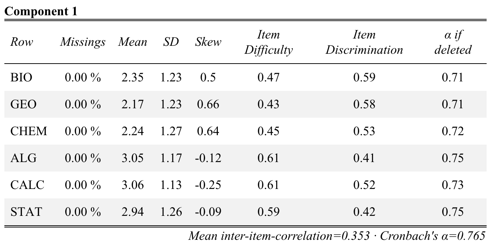

# Equipo Docente

-   Profesor: Daniel Miranda (danmiranda\@uchile.cl)
-   Apoyo Docente: Felipe Varas

# Ejemplo EFA: Rendimiento en asignaturas

## Cargar paquetes

```{r results='hide'}

pacman::p_load(stargazer, # Reporte a latex
sjPlot, sjmisc, # reporte y gráficos
corrplot, # grafico correlaciones
xtable, # Reporte a latex
Hmisc, # varias funciones
psych, # fa y principal factors
psy, # scree plot function
nFactors, # parallel
GPArotation, devtools, ggrepel, EFAtools, psychTools) # rotación

```

# Datos

## Lectura de datos

```{r tidy=FALSE}
data = read.csv("./efa_asignaturas.csv")

#knitr::purl("/Users/daniel/Dropbox (Personal)/FACSO/Teaching/Doctorado/2026/Cuantitativa I/Clases/clase8_efa_alpha/Práctica EFA/practica_efa_conf.qmd")

#purl("test.Rmd", output = "test2.R", documentation = 2)

```

-   Muestra de 300 alumnos a los que se le pregunta por su asignatura favorita en una escala de 1 (no me agrada) a 5 (me agrada)

## Exploración de datos

```{r }
summary(data)

head(data) # muestra 6 primeros casos, 
           # útil para revisar lectura de datos

dim(data)  # filas columnas

nrow(na.omit(data)) # número de casos con datos completos

View(data)

str(data)

names(data)
```

## Descripción datos

```{r }
stargazer(data, type = "text")  # para visualizar en consola

```

```{r results='asis', eval=FALSE}
stargazer(data, type = "html") # a html
```

```{r }
#sjplot(data$BIO, "frq") # no muy buena descripción ...

plot_frq(data) 

```

## Un par de mejoras: leyenda, colores, sentido categorías

```{r }
data2=6-data # recode items para que más acuerdo vaya a la derecha
labels <- c("Muy de acuerdo", "De acuerdo","Neutro", "Desacuerdo", "Muy en desacuerdo")
items <- c("Biología", "Geografía", "Química", "Algebra", "Cálculo", "Estadística")

```

## Gráfico final

```{r fig.width=8,fig.height=4}
plot_likert(data2, 
           legend.labels = labels,
           axis.labels = items,
           cat.neutral = 3, # identifica a indiferentes
           geom.colors = "PuBu", # colorbrewer2.org para temas 
           sort.frq = "neg.asc" # sort descending
           )  

```

```{r, results='asis'}
#sjPlot::tab_stackfrq(data2)

```

# Analisis de matriz de correlaciones

## Matriz

```{r }
corMat  <- round(cor(data), 2) # estimar matriz pearson

corMat # muestra matriz

```

## Reporte tabla

```{r results='asis'}
#tab_corr(data, triangle = "lower") # Tabla en html

stargazer(corMat, title="Correlaciones") #Latex table

```

## Reporte gráfico con corrplot

```{r }
M=cor(data) # matriz simple de correlaciones de los datos
corrplot(M, type="lower") # lower x bajo diagonal
```

## Otra opción

```{r }
corrplot(M, type="lower",
      order="AOE", cl.pos="b", tl.pos="d") #agrega nombres en diag.
```

¿Qué se puede deducir de esta matriz de correlaciones en relación a la estructura subyacente en términos de variables latentes?

# Adecuación de matriz para análisis factorial

```{r }
KMO(corMat) 
cortest.bartlett(corMat, n = 300)
```

## Extracción

### Ejes principales

```{r }
fac_pa <- fa(r = data, nfactors = 2, fm= "pa")
#summary(fac_pa)
fac_pa

sjPlot::tab_fa(fac_pa)
```

### Maximum likelihood

```{r }
fac_ml <- fa(r = data, nfactors = 2, fm= "ml")
fac_ml

sjPlot::tab_fa(fac_ml)
```

### Plot de cargas factoriales ml

```{r }
factor.plot(fac_ml, labels=rownames(fac_ml$loadings))
```

### Puntajes factoriales

```{r }
fac_ml <- fa(r = data, nfactors = 2, fm= "ml", scores="regression")
data2=data
data3 <- cbind(data2, fac_ml$scores)
head(data3)

```

# Seleccion de numero de factores

## Gráficos

```{r }
scree.plot(data)   
```

```{r }
fa.parallel(corMat, n.obs=300)  
```

```{r eval=FALSE, echo=FALSE}
library(nFactors)
ev <- eigen(corMat) # get eigenvalues
ap <- parallel(subject=300,var=6,
  rep=100,cent=.05)
nS <- nScree(x=ev$values, aparallel=ap$eigen$qevpea)
plotnScree(nS)


#Factor de aceleración: solución numérica que muestra el punto que presenta el mayor cambio de pendiente

#Optimal coordinates: muestra el primer eigenvalue que puede ser mejor "extrapolado" desde el eigenvalue previo ("optimal coordinates are the extrapolated coordinates of the previous eigenvalue that allow the observed eigenvalue to go beyond this extrapolation" (http://www.inside-r.org/packages/cran/nFactors/docs/nScree)
```

## Rotación

### Varimax (ortogonal)

```{r }
fac_ml_var <- fa(r = data, nfactors = 2, fm= "ml", rotate="varimax") # ortogonal
fac_ml_var

```

### Promax (oblicua)

```{r }
fac_ml_pro <- fa(r = data, nfactors = 2, fm= "ml", rotate="promax")
fac_ml_pro

```

## Reporte: Tabla análisis factorial

### A html via sjPlot

```{r eval=FALSE, results='markup'}
# tab_fa(data, method="ml", rotation = "varimax", show.comm = TRUE, title = "Análisis factorial asignaturas")

```

### Tabla de latex

```{r results="asis", eval=FALSE, echo=TRUE}
str(fac_ml_pro$loadings)
class(fac_ml_pro$loadings)
```

```{r results="asis", eval=TRUE, echo=TRUE, message=FALSE, error=FALSE}
xtable(unclass(fac_ml_pro$loadings))

# fa2latex(fac_ml_pro) # Función desactualizada
```

# Ejemplo Confiabilidad: Rendimiento en asignaturas

### Análisis de Confiabilidad: **psych::alpha**

```{r, results='markup'}

psych::alpha(data)

```

### Análisis de Confiabilidad: sjPlot

```{r, eval=FALSE}
sjPlot::tab_itemscale(data)

```

```{r, echo=FALSE, out.width = '70%', fig.retina = 1, fig.align='center'}

```

```{r}

sci= data%>%
 dplyr::select(BIO, CHEM, GEO)

sjPlot::tab_itemscale(sci)
```

```{r}

mat= data%>%
 dplyr::select(ALG, CALC, STAT)

sjPlot::tab_itemscale(mat)
```

### Análisis de Confiabilidad: **OMEGA**

```{r}

psych::omega(sci, plot=FALSE)

```

```{r}

psych::omega(mat, plot=FALSE)

```

# Introducción

Este documento resume las actividades para el análisis de regresión. Comienza con el análisis de confiabilidad de un indicador que luego se utiliza en un modelo de regresión.

## Instalar o instalar librerías útiles para la sesión

```{r, message=FALSE, warning=FALSE}
#install.packages(c("splitstackshape","psych"))
library(readr)
library(splitstackshape)
library(psych)
library(summarytools)
library(skimr)
library(ggplot2)
library(dplyr)
library(kableExtra)
library(table1)
library(modest)
library(BSDA)
library(crosstable)
library(gmodels)
library(corrplot)
library(sjPlot)
library(stargazer)
library(rio)
library(performance)
library(see)
library(interactions)
```

## Lectura de datos

Para nuestro análisis de datos se generó una base que evalúa multiples actitudes. Las c05_01 a la c05_08 se orientan a evaluar el grado de confianza en instituciones (por ejemplo: confianza en el Gobierno, Los Partidos Políticos, El Parlamento, etc.).

```{r, message=FALSE, warning=FALSE}

base= rio::import("https://www.dropbox.com/scl/fi/wo7rvoz0lw9wkx65boen8/ELSOC_W01_subset.csv?rlkey=kox9y3ie7n61dj26hidg91o56&dl=1")
names(base)
```

## Vista previa de la de datos

Los siguientes códigos permiten explorar los datos de manera general.

```{r}
# Vista previa de los datos
View(base)

# Mostrar los nombres de las variables contenidas en la base datos
names(base)

# Muestra el número de filas y columnas (casos y variables)
dim(base)

# Muestra los primeros 10 casos de la base para todas las variables
head(base, 10)

# Muestra los primeros 10 casos de la base para una variable específica
head(base$c01, 10)

```

Otra forma de describir los datos rápidamente es usando la librería `summarytools`. Esta genera información para cada variable.

```{r , results='asis'}
print(summarytools::dfSummary(base, method = "render")) ## Descripción de la base de datos

```

\newpage

# Confiabilidad como consistencia interna

La confiabilidad/precisión apunta al nivel de incertidumbre que está asociado con las mediciones que son generadas por un instrumento de medición.

Si bien es solo una de muchas formas de calcular un coeficiente de confiabilidad el alfa de Cronbach es muy usado en la psicología. Este es probablemente el indicador estadístico más solicitado, más reportado en psicología.

Se lo considera una medida de consistencia interna.

-   Aumenta cuando la inter-correlación entre los ítems aumenta. Por lo tanto aumenta cuando todos los ítems miden el mismo constructo.

-   Indirectamente indica el grado en que un conjunto de ítems mide un constructo unidimensional simple.

Guías de interpretación:

-   $≥ .90 : Excelente$

-   $0.7 a 0.9: Bueno$

-   $0.6 a 0.7: Aceptable$

-   $0.5 a 0.6: Pobre$

-   $< 0.5: Muy Pobre$

### Descripción de la asociación entre indicadores de Confianza

Matriz de correlaciones

```{r  echo=TRUE, results='markup'}
## Seleccionamos las variables a analizar
conf=base%>%
  dplyr::select(c05_01, c05_02, c05_03, c05_04, c05_05, c05_06, c05_07, c05_08)

tab_corr(conf)
```

Gráfico de correlaciones

```{r  echo=FALSE}
M <-cor(conf, use = "complete.obs")

corrplot(M, type="upper", order="hclust")

```

Aquí vemos que todos los ítemes considerados presentan correlaciones: positivas, pequeñas o medianas y estadísticamente significativas.

### Estimación de Alfa de Cronbach.

```{r}
tab_itemscale(conf)
```

¿Qué te muestra esta tabla?

-   Puedes ver qué ítemes incluiste a través de *Row*

-   Puedes ver con qué frecuencia falta casos a través de *Missing*

-   Puede ver estadísticas descriptivas de los ítemes mediante *Mean, SD y Skew*

-   Puede ver cuán útiles son los ítemes para medir el concepto latente de Confianza en Instituciones a través de la dificultad del ítem, la discriminación del íteme y *alpha de Cronbach* si se elimina el ítem.

Aquí, nos centraremos en la discriminación y los valores del *alpha de Cronbach*:

-   Compruebe si los valores de Discriminación están por encima de .2. Esto indica el grado en que un ítem nos ayuda a discriminar entre participantes que obtuvieron puntuaciones muy bajas o altas en confianza.

-   Comprobar si el *alpha de Cronbach* es superior a 0,7. Cuanto más alto, mejor. Si en el *alpha de Cronbach* los valores aumentan bruscamente tan pronto como uno de los elementos no se considera para el análisis (es decir, "eliminado" según la tabla), esto indica que podemos considerar no usarlo para índice.

-   Aquí, parece que todos los ítems discriminan bien (todos los valores de Discriminación de Ítems son suficientemente altos) y que, juntos, forman un índice con validez satisfactoria, ya que *alpha de Cronbach* para los ocho ítems es de un 0.806.

-   Si hubiera algún indicador que muestra un *alpha si el item es eliminado* mejor que el observado, entonces sugiere que ese ítem podría ser eliminado. Por ejemplo, si algún ítem presenta un *alpha si el item es eliminado* de 0.85, entonces se sugeriría eliminar ese ítem. Por lo tanto, la escala quedaría compuesta por 7 ítemes en vez de ocho.

### Conclusión acerca de la escala de Confianza.

Podemos utilizar los cinco elementos de Confianza para crear un índice medio llamado Confianza_institucional(conf_inst). Creamos este índice como el promedio de las 8 variables consideradas en el *alfa de Cronbach*. La justificación de hacer esto es que el *alfa de Cronbach* es bueno.

```{r}
base <- base %>%
  dplyr::mutate(conf_inst= (c05_01 + c05_02 + c05_03 + c05_04 + c05_05  + c05_06 + c05_07 + c05_08)/8)

## Revisar la variable agregada
#print(summarytools::dfSummary(base, method = "render")) ## Descripción de la base de datos
names(base)

hist(base$conf_inst)

skim(base$conf_inst)
```
