```{r}
#| label: setup
#| include: false
library(knitr)
knitr::opts_chunk$set(#echo = F,
                      warning = F,
                      error = F, 
                      message = F,
                      cache=T) 
```

::: columns
::: {.column width="15%"}

:::

::: {.column .column-right width="85%"}
<br>

## **Métodos Cuantitativos de Investigación Psicológica I**

Daniel Miranda

::: {.blue .medium}
Contacto: danmiranda\@uchile.cl
:::

2026
:::
:::

# Presentación

## Identifique el o los errores

```{r echo=FALSE, out.width = '90%', fig.align='center'}
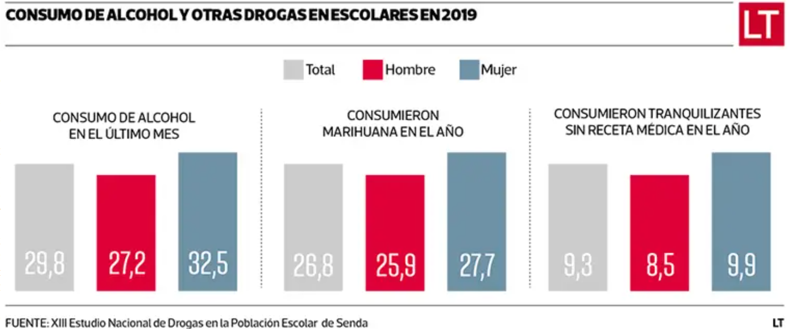
```

## Identifique el o los errores

```{r echo=FALSE, out.width = '50%', fig.align='center'}
knitr::include_graphics('img/femin.jfif')
```

## Identifique el o los errores

```{r echo=FALSE, out.width = '60%', fig.align='center'}
knitr::include_graphics('img/error.jfif')
```

## Identifique el o los errores

```{r echo=FALSE, out.width = '70%', fig.align='center'}
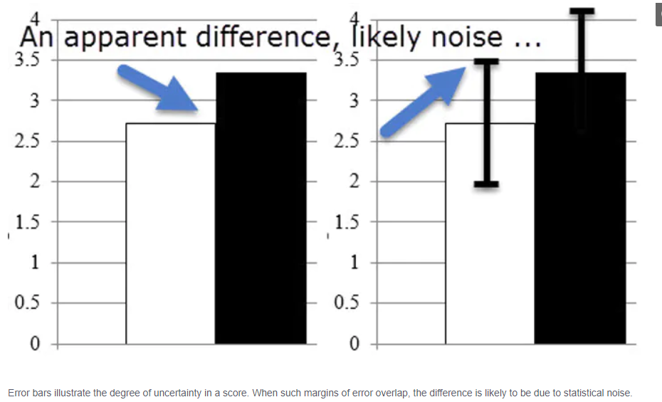
```

## Estamos rodeados de aplicaciones estadísticas en...

-   Psicología

-   Sociología

-   Ciencia Política

-   Economía

-   Salud Publica: *la pandemia ha relevado su importancia*

# $\bar{X} = \frac{\sum_{i = 1}^{n} x_i}{N}$

## Objetivo del curso

-   Se espera que los y las estudiantes conozcan las principales potencialidades y limitaciones del enfoque cuantitativo de investigación en Psicología, así como de los distintos métodos, diseños y técnicas. Se espera también que comprendan conceptos y técnicas relevantes para la investigación cuantitativa, como: estadística descriptiva, estadística inferencial, medición en psicología, análisis de la varianza, regresión; y sepan aplicar los procedimientos necesarios para analizar datos considerando su pertinencia.

## Objetivos Específicos

a)  Comprender los elementos conceptuales que permiten el desarrollo de investigaciones cuantitativas en psicología.

b)  Conocer los fundamentos de estadística descriptiva e inferencial.

c)  Conocer los fundamentos de la medición en ciencias sociales y aplicar técnicas de construcción.

d)  Aplicar, interpretar y reportar técnicas multivariadas de análisis de datos para la investigación psicológica.

## Contenidos

Módulo 1: Enfoque Cuantitativo de Investigación en Psicología

− Características del enfoque cuantitativo, potencialidades y limitaciones.

− Probabilidades y distribuciones

− Muestras, muestreo y potencia estadística

− Inferencia y contraste de hipótesis.

## Contenidos

Módulo 2: Técnicas de Análisis Multivariado

− Técnicas de análisis de la varianza: ANOVA, ANOVA factorial.

− Covarianza y correlación.

− Regresión simple y múltiple

− Regresión logística

## Contenidos

Módulo 3: Medición en Psicología

− Características de la medición en ciencias sociales.

− Construcción de instrumentos de medición: estándares.

− Modelos de medida, TCT, Análisis Factorial

## Metodologías de enseñanza-aprendizaje que se emplearán en este curso

El curso se desarrollará a través de las siguientes actividades:

− Clases expositivas y discusión de contenidos.

− Trabajos prácticos usando software estadístico.

− Trabajos prácticos fuera de clases.

## Evaluaciones

La calificación final del curso se obtendrá a través de la ponderación de múltiples evaluaciones que incluirán tanto de elementos conceptuales como aplicados. Las evaluaciones tendrán la siguiente ponderación. 3 pruebas:

-   Prueba 1 (20%)

-   Prueba 2 (30%)

2 talleres de análisis de datos (50%):

-   25% cada taller

## Cronograma

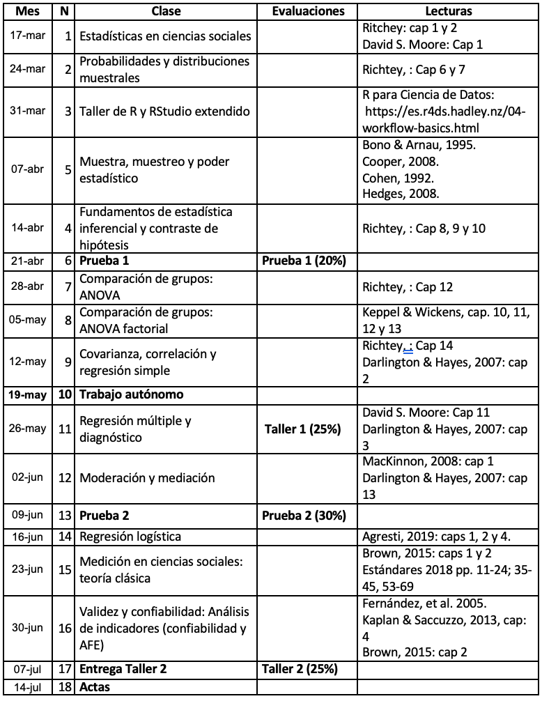{fig-align="center" width="45%"}

## Concepto del curso

-   Es un curso que enseña algunas técnicas de análisis cuantitativo orientadas al contraste empírico de teoría, para lo cual se utilizan técnicas estadísticas. En este contexto, los métodos son considerados funcionales a preocupaciones sustantivas y relevantes del mundo social.

-   Adicionalmente, es necesario considerar que para poder realizar investigación de manera eficiente y generativa es importante no "reinventar la rueda", preocupándose de que nuestros análisis sean comprensibles para los demás (y para nosotr_s en el futuro). Por ello utilizamos programas de análisis de código abierto (como R) y promovemos que los códigos de análisis sean ordenados y comprensibles.

# Y partimos!!

## Múltiples fenómenos

-   Funcionamiento psicológico: percepción, actitudes, conocimientos, creencias, comportamientos, etc.

-   Procesos de interacción: relaciones sociales, familiares, etc.

-   Relación con el mundo: la vida política, la vida en las organizaciones, la vida en comunidad.

-   Pobreza, desigualdad y sus correlatos psicosociales

-   Información en organizaciones: Clima, información financiera, proyecciones, etc.

-   Entre otros muchos temas...

## Múltiples fenómenos: ¿qué es y cómo se mide?

```{r echo=FALSE, out.width = '80%', fig.align='center'}
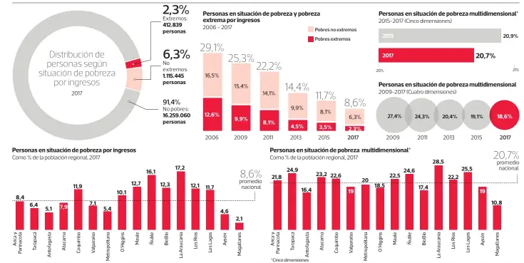
```

## Múltiples fenómenos: ¿qué es y cómo se mide?

```{r echo=FALSE, out.width = '80%', fig.align='center'}
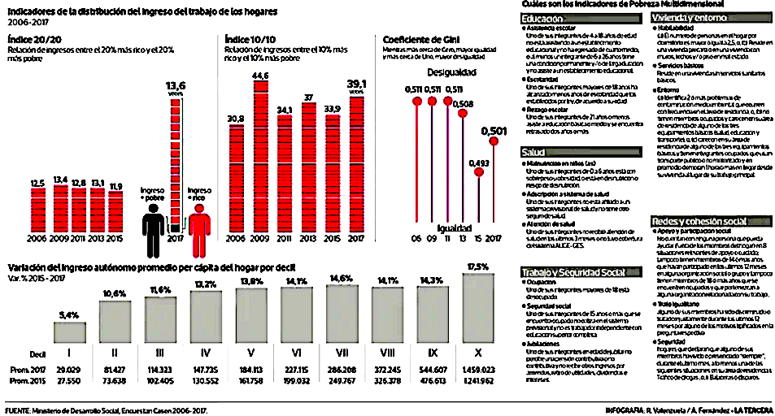
```

## Dimensión Ética en Estadística

-   Uso para investigación!

-   Uso para evaluar y tomar decisiones en múltiples ámbitos .. Por ejemplo

-   Políticas Públicas

-   Organizaciones laborales

-   Diagnósticos y tratamientos psicológicos y médicos

-   Temas de seguridad nacional, Etc.

-   Estándares y rigurosidad.

## De constructos a variables en una base de datos

-   La investigación, usualmente, se centra usualmente en definir variables de interés.

-   Usando una perspectiva cuantitativa podemos describir, resumir y modelar el comportamiento de esas variables.

-   Entonces para realizar investigación cuantitativa es necesario **cuantificar** los fenómenos

-   Esto es parte del proceso de operacionalización

-   El análisis utiliza **relaciones matemáticas** entre las variables

## Variables en la Investigación

-   **¿Qué es una variable?**

-   Al hacer una investigación buscamos estudiar ciertas características de un fenómeno de interés.

-   En la perspectiva cuantitativa, estudiar una variable implica, de alguna forma, poder medir su comportamiento (lo que conocemos como OPERACIONALIZAR la variable).

-   Una VARIABLE es una característica que al ser medida en distintas circunstancias (contextos, personas) asume distintos valores.

-   Si una característica no asume distintos valores dentro de la medición, hablamos de una CONSTANTE .

## Base de Datos

-   Una **BASE DE DATOS** es un conjunto de datos referentes a un determinado contexto (un grupo de personas, instituciones, fenómeno), ordenadas de modo que permitan su análisis.

-   En estadística, una base de datos define una serie de **VARIABLES**, las que se identifican por nombres distintos.

-   Para cada variable se cuenta con una serie de **VALORES**, que corresponden a la forma en que cada variable se presenta en cada uno de los casos evaluados.

-   Usualmente las bases de datos se presentan en forma de planillas, ubicando en las **COLUMNAS** (verticales) las variables y en las **FILAS** (horizontales) los valores o casos.

## Medición en ciencias sociales

¿Qué queremos medir?

-   Definición de un constructo

¿Cómo lo medimos?

-   Operacionalización

-   Diseño de itemes

-   Espacio de respuestas

¿Qué nos indica la medición?

-   Modelo de análisis de respuestas

## Medición en ciencias sociales

Medición: la acción de asignar números o símbolos a características de acuerdo a ciertas reglas (Stevens, 1946)

Reglas: guías para representar la magnitud o características del objeto medido

Medición en psicología o educación (psicometría): asignación de números a características psicológicas

## Medición en ciencias sociales

```{r echo=FALSE, out.width = '70%', fig.align='center'}
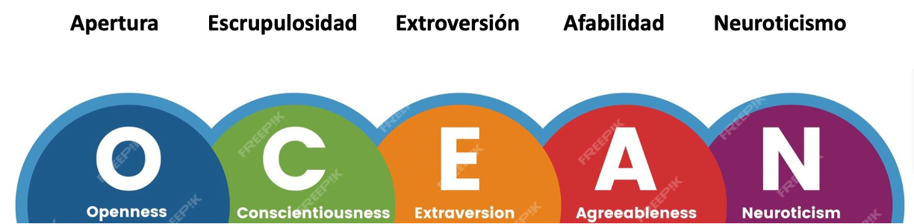
```

## Medición en ciencias sociales

```{r echo=FALSE, out.width = '70%', fig.align='center'}
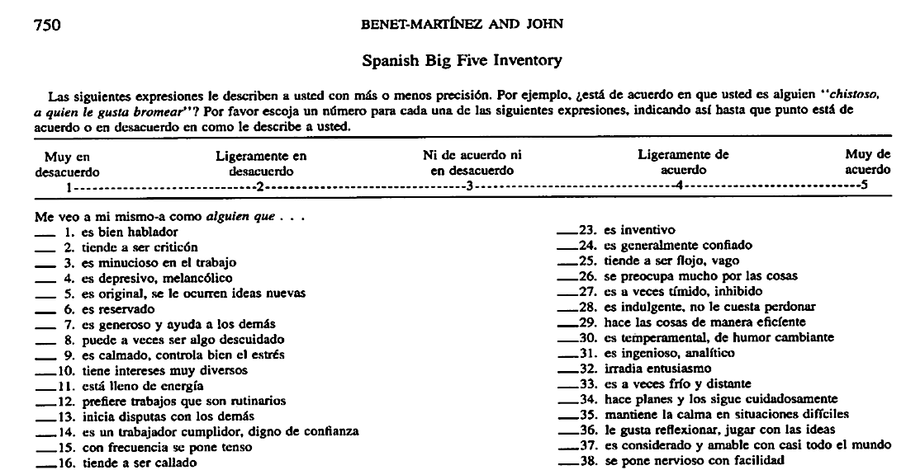
```

## Básicamente

Variable: cualquier cosa o propiedad que varía

Constante: no presenta variación

-   Pueden ser visibles / no visibles, latentes

Variables discretas

-   Rango finito de valores

• Dicotómicas

• Politómicas

Variables continuas:

-   Rango infinitos de valores

## Niveles de Medición

-   Un aspecto muy importante a considerar es el nivel de medición asignado a las variables incorporadas en el estudio.

-   El nivel de medición de una variable indica la propiedad numérica que esa variable puede tener (y por lo tanto los códigos usados para sus valores).

Regla: Aceptar sólo como relaciones válidas entre los números aquellas que tengan sentido considerando el fenómeno estudiado

## Habría 4 Niveles de Medición

-   Nominal: Los números solo identifican distintas modalidades de las variables.

-   Ordinal: Además de identificar distintas modalidades, los números establecen una jerarquía entre las modalidades de las variables (alguna son mayores que otras, pero sin una separación estable entre un nivel y el siguiente

-   Intervalar : Además de identificar y ordenar los valores de la variable, establece intervalos entre los valores que son siempre los mismos. Esto permite realizar operaciones aritméticas (suma-resta) entre valores de las variables.

-   Razón: Además de todas las propiedades anteriores, se asigna un cero absoluto (no arbitrario). Esto permite establecer relaciones de proporcionalidad entre los valores de las variables.

## Niveles de medición

-   Nominal
    -   Igualdad o desigualdad
-   Ordinal
    -   Orden o jerarquía
-   Intervalar
    -   Magnitud constante
-   Razón
    -   Valor cero no es arbitrario

## Escalas nominales

-- Del latin nomen (nombre)

-- Los números son empleados como "etiquetas" para identificar características

-- Fines analíticos: la asignación de números en lugar de los nombres facilita luego operaciones de análisis cuantitativo

-- Propiedad de los números: identidad

-   Todos los miembros de una misma categoría deben ser asignados al mismo número

-   Distintas categorías no pueden utilizar el mismo número

## Escalas ordinales

-   Los elementos de distintas categorías pueden ser ordenados en una serie de menos a más (o viceversa)

-   Dice información sobre la posición, no sobre la distancia entre los individuos

-   Resultados reportados usualmente como rangos de percentil, y asociaciones con otras escalas con el coeficiente de correlación de Spearman

-   Característicos de la medición psicológica, principalmente social y de personalidad

## Escalas intervalares

-   Escalas de unidades iguales (equal-unit scales)

-   Las diferencias entre dos números consecutivos reflejan la diferencia empírica o demostrable entre los objetos representados

-   No existe un cero absoluto

## Escalas de razón

-   Propiedad sumativa

-   Punto cero absoluto (ej. Número de clientes)

-   Resultados pueden ser expresados como una proporción

-   Características de las ciencias naturales

-   En psicología se utilizan principalmente al contar frecuencias de eventos o intervalos de tiempo

## Niveles de medición

-   Nominal (género, carrera )

-   Igualdad o desigualdad (= y $\neq$)

-   Ordinal ( NSE, nivel educacional )

-   Orden o jerarquía (\> y \<)

-   Intervalar ( actitudes, personalidad )

-   Magnitud constante (+ y -)

-   Razón ( monto de una donación )

    -   Valorcero no es arbitrario (x o $/$)

## Niveles de medición

```{r tbl39, echo = FALSE}
tbl39 <- tibble::tribble(
~`Escala`, ~`Nominal`, ~`Ordinal`, ~`Intervalar`, ~`Razón`,
"Operación  empírica","Determinación de igualdad","Determinación de más o menos","Determinación de igualdad de intervalos","Determinación de igualdad de razones",
"Estadísticos permisibles","Cuenta Moda","Mediana - Percentil","Promedio Desv. Estand.","Coeficientes de variación"
)

kableExtra::kable_styling(knitr::kable(tbl39), font_size = 18)
```

## Niveles de medición

-   ¿A qué niveles de medición corresponden las siguientes variables?

-   NSE alto, NSE medio, NSE bajo

-   Santiago, Providencia, Recoleta, Antofagasta

-   350, 400, 500, 600, 750, 820 (Puntos de SIMCE)

-   Nada feliz, Algo feliz, Muy feliz

## Niveles de medición

-   Siempre tenemos que considerar a qué nivel corresponde el constructo que queremos medir.

    -   Por ejemplo, si bien es posible medir estado de ánimo a un nivel nominal, u ordinal, una medición a nivel intervalar es más adecuada.

    -   Por lo tanto, esta decisión es teórica . Depende de la definición teórica del constructo.

    -   Conocer los niveles de medición permite saber qué tipos de análisis podemos realizar con los datos.

## Tipos de datos en relación a escalas de medición:

Datos categóricos: pueden ser medidos sólo mediante escalas nominales, u ordinales en caso de orden de rango

Datos continuos:

-   Medidos en escalas intervalares o de razón

-   Pueden ser transformados a datos categóricos

# Estadística descriptiva e inferencial

## Estadística descriptiva e inferencial

-   La estadística es un lenguaje para comunicar información basada en datos cuantitativos.

-   La estadística descriptiva sirve para sintetizar o resumir los datos obtenidos a partir de un conjunto de observaciones

-   La estadística inferencial utiliza la información de la estadística descriptiva para realizar procesos que permiten, dentro de ciertos rangos de confianza, determinar el comportamiento de la población que es representada por la muestra

## Estadística descriptiva

-   Indicadores que describen distintos aspectos de las observaciones realizadas.

  -   Tremendamente importantes para explorar y presentar los resultados de un estudio (describe el comportamiento de una muestra)

   -   Son los indicadores sobre los cuales se realiza estadística inferencial (se infiere a la población)

## Estadística descriptiva: veamos algunos ejemplos

```{r echo=FALSE, out.width = '35%', fig.align='center'}
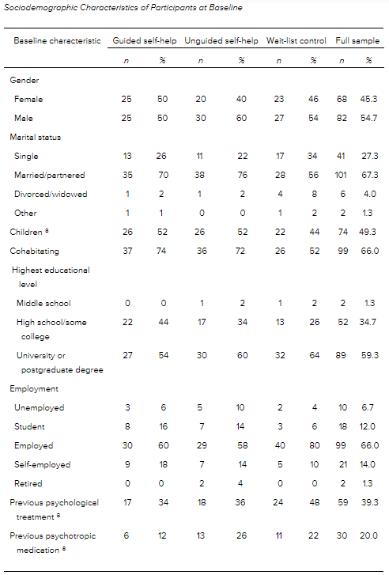
```

## Estadística descriptiva: veamos algunos ejemplos

```{r echo=FALSE, out.width = '50%', fig.align='center'}
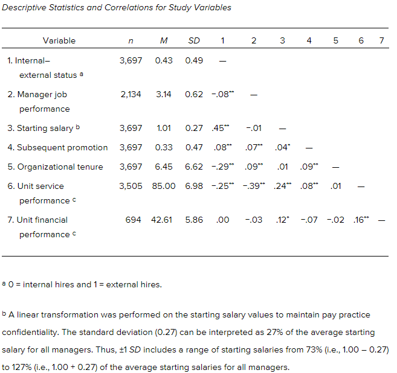
```

## Estadística descriptiva: veamos algunos ejemplos

```{r echo=FALSE, out.width = '70%', fig.align='center'}
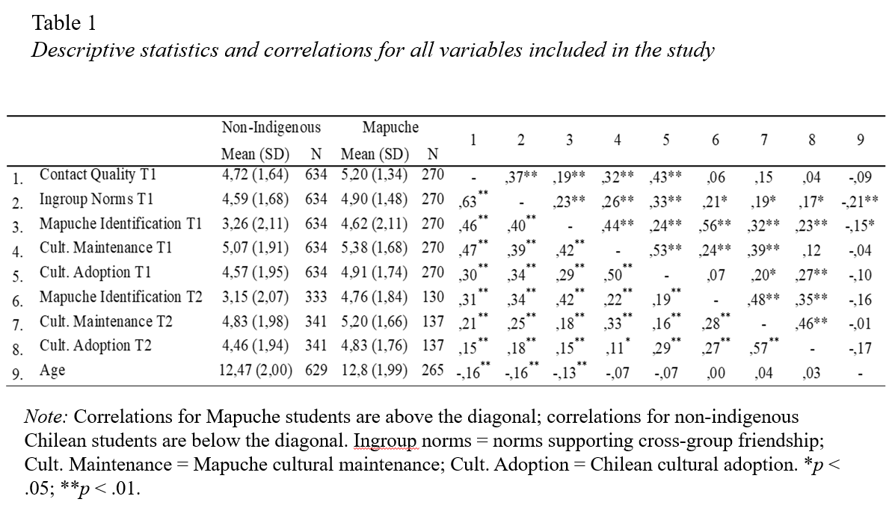
```

## Estadística descriptiva: veamos algunos ejemplos

```{r echo=FALSE, out.width = '60%', fig.align='center'}
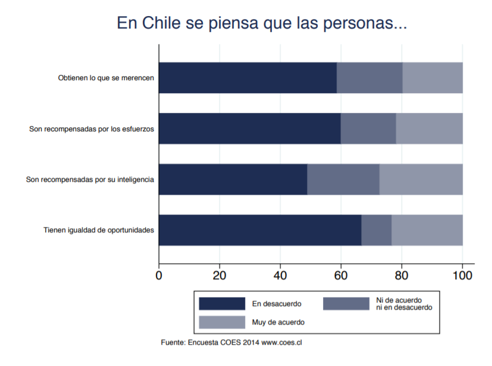
```

## Estadística descriptiva: veamos algunos ejemplos

```{r echo=FALSE, out.width = '80%', fig.align='center'}
knitr::include_graphics('img/peso.jfif')
```

## Estadística descriptiva: veamos algunos ejemplos

```{r echo=FALSE, out.width = '80%', fig.align='center'}
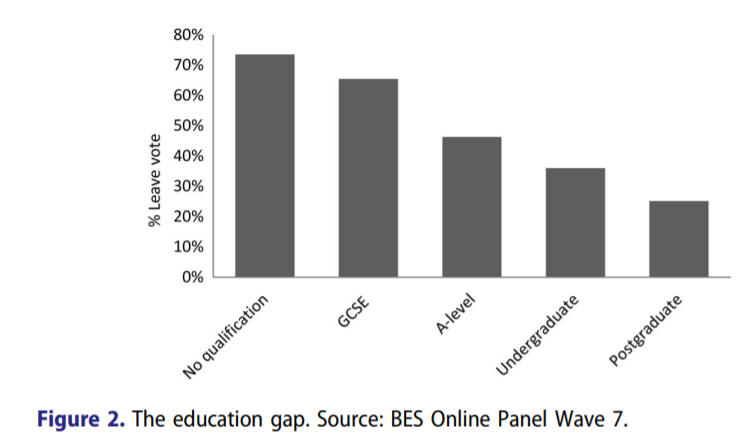
```

# Tabulación y Graficación

## Tabulación y Graficación

-   Los análisis estadísticos son estrategias para traducir la información obtenida a un formato que sea interpretable.

-   Por mucho que miremos una base de datos, difícilmente vamos a poder entender qué significan esos números.

-   La estrategia más sencilla es mostrar la información en un formato visual (gráficos) o en un esquema sintetizado (tablas)

## Tablas y gráficos

-   En general, cualquier tabla puede ser presentada en formato gráfico.

-   ¿Qué elegir?

-   La decisión depende de la cantidad de información presentada y el uso que vaya a darse a ella.

-   Los gráficos permiten una comprensión global más inmediata, las tablas una revisión más detallada.

# Tabulando la información

## Tablas de síntesis de resultados

-   Al reportar los resultados de una investigación, es común construir tablas que resumen el comportamiento de una serie de variables.

-   La idea general es condensar la mayor cantidad de información evitando la redundancia de información.

-   Estas tablas se diseñan a partir de distintos análisis realizados sobre los datos pero que apuntan a un área temática común, como por ejemplo, la descripción demográfica de la muestra.

## Tablas de frecuencia

-   La forma más sencilla de presentar la información obtenida en un estudio es contabilizar el número de veces que aparece cada respuesta.

-   Este indicador se conoce como la frecuencia de aparición da cada respuesta. En símbolos $f$

-   Cuando presentamos una variable indicando la frecuencia de aparición de cada uno de sus valores, tenemos una tabla de frecuencia .

## Tablas de frecuencia

-   Las frecuencias son, sin embargo, datos absolutos. No es fácil comparar los resultados de dos tablas con un N total de respuestas diferente.

-   Para hacer esas comparaciones, se utilizan medidas estandarizadas, esto es, transformaciones de los puntajes originales a escalas que sean las mismas en todas las tablas (y que permiten la comparación)

## Tabulación de datos

Estandarizan los puntajes, permitiendo su comparación - Proporción (p)

-   Porcentaje (%)

Permiten analizar el comportamiento de la variable

-   Frecuencias Acumuladas

-   Porcentajes Acumulados

## Medidas estandarizadas

-   Proporción

$$p = \frac{f}{N} $$

$p$ = proporción

$f$ = número de casos

N = número total de observaciones

-   Porcentaje

$$ \% = p \times 100 $$


## Estandarizando la frecuencia

$$ Proporción(p):  p = \frac{f}{N} $$

-   $f$ = n° de casos favorables

-   N = n° total de observaciones

-   Una proporción es una relación entre dos magnitudes. En **Estadística Descriptiva** usualmente se usa como indicador de proporción la razón (división) que existe entre la frecuencia de aparición de un valor de una variable(f) y el total de casos (N). Por este motivo se la conoce también como *frecuencia relativa*.

## Estandarizando la frecuencia

$$ Proporción(p):  p = \frac{f}{N} $$

-   Propiedades:

-   Varía entre 0 y 1

-   La suma de las proporciones de los valores de una tabla da siempre 1

-   Es un óndice de la probabilidad de aparición de los valores de las variables.

## Estandarizando la frecuencia

$$ Porcentaje(\%):  \% = p \times 100 $$

-   El porcentaje nos indica cuántos casos de cada 100 presentan un determinado atributo (valor) de una variable. Nos entrega la misma información que la proporción, pero en un formato más amigable.

-   Como lleva todo a una escala de 0 a 100 suele ser poco apropiado en muestras muy pequeñas, ya que suele dar una idea sobrevalorada de la importancia del atributo evaluado

## Estandarizando la frecuencia

$$ Porcentaje(\%):  \% = p \times 100 $$

-   Propiedades:
    -   Varía entre 0 y 100
    -   La suma de las proporciones de los valores de una tabla da siempre 100
    -   Puede usarse como óndice de la probabilidad de aparición de los valores de las variables.
    -   Como lleva todo a una escala de 0 a 100 suele ser poco apropiado en muestras muy pequeñas, ya que suele dar una idea sobrevalorada de la importancia del atributo evaluado

## Tablas de frecuencia y datos acumulados

Grado de Felicidad personas evaluadas

```{r tbl28, echo = FALSE}
tbl28 <- tibble::tribble(
~`Puntaje`, ~`f`, ~`F`, ~`p`, ~`%`, ~`% Ac`,
"Muy poco feliz","160","160","0.10","10.31","10.31",
"Poco feliz","398","558","0.26","25.64","35.95",
"Relativamente feliz","610","1168","0.39","39.30","75.26",
"Bastante feliz","310","1478","0.20","19.97","95.23",
"Muy feliz","74","1552","0.05","4.77","100",
"Total","1552"," ","1.00","100.0%"," "
)

kableExtra::kable_styling(knitr::kable(tbl28), font_size = 18)
```

## Datos acumulados

-   Los datos acumulados nos indican, para cada valor de una variable, el monto o la proporción o porcentaje de casos que hay "hasta" ese valor.

-   Requiere que los datos tengan al menos un nivel de medición ordinal.

-   En la tabla siguiente, por ejemplo, podemos decir que "hasta relativamente feliz" se declaran 1168 personas, que equivalen al 75.26% de los casos evaluados.

-   En base a esto podemos decir que en una muestra clínica como la nuestra $3 / 4$ de las personas evaluadas reportan niveles de felicidad medios o bajos

## Tablas de frecuencia

¿La democracia es preferible a cualquier otra forma de gobierno? (1, "completamente en desacuerdo"; a 7, "completamente de acuerdo")

```{r tbl29, echo = FALSE}
tbl29 <- tibble::tribble(
~`Puntaje`, ~`f`, ~`%`, ~`% asc`, ~`% des`,
"1","99","5.0%","5.0%","100.0%",
"2","44","2.2%","7.2%","95.0%",
"3","94","4.7%","11.9%","92.8%",
"4","212","10.7%","22.6%","88.1%",
"5","231","11.6%","34.2%","77.4%",
"6","415","20.9%","55.1%","65.8%",
"7","893","44.9%","100.0%","44.9%",
"Total","1988","100.0%","100.0%","100.0%"
)

kableExtra::kable_styling(knitr::kable(tbl29), font_size = 18)
```

## Normas APA para tablas

```{r echo=FALSE, out.width = '80%', fig.align='center'}
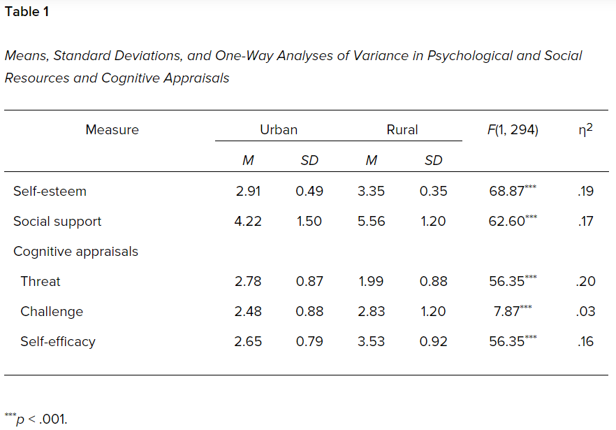
```

## Normas APA para tablas

Las tablas pueden presentar tanto datos cuantitativos como texto. El formato recomendado para tablas es el siguiente:

-   Los números de las Tablas son arábigos, alineado a la izquierda, sin cursivas, por encima de la tabla.

-   Las tablas deberían ser numeradas en el orden en que son mencionadas en el texto

-El título de la tabla debe aparecer debajo del número de la tabla, alineado a la izquierda, cursiva, en mayúsculas y minúsculas, doble espaciado

-   Los títulos deben ser breves y claros

-   Los encabezados de las columnas usan mayúsculas solo en la primera letra de la primera palabra.

## Normas APA para tablas

Las tablas pueden presentar tanto datos cuantitativos como texto. El formato recomendado para tablas es el siguiente:

-   Solo usar líneas horizontales, no verticales.

-   Las notas de las tablas se indican bajo la tabla en tamaño más pequeño, con la palabra Nota:

-   Las notas específicas son indicadas por letras en superóndice

-   Tablas extremadamente detalladas deben ser presentadas en los apéndices

# Gráficando la información

## Graficación

```{r echo=FALSE, out.width = '70%', fig.align='center'}
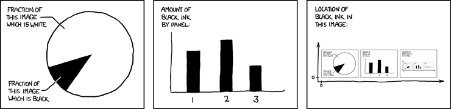
```

-   Hay ciertas normas formales que están construidas para facilitarle la vida al lector

-   Los gráficos y tablas deben ser comprensibles sin leer el texto; el texto también debe ser comprensible sin ver las figuras y debe hacer referencia a ellas cuando corresponda.

-   gráficos y tablas deben ser numerados y tener un título descriptivo.

## Múltiples formas de mostrar lo mismo

```{r echo=FALSE, out.width = '40%', fig.align='center'}
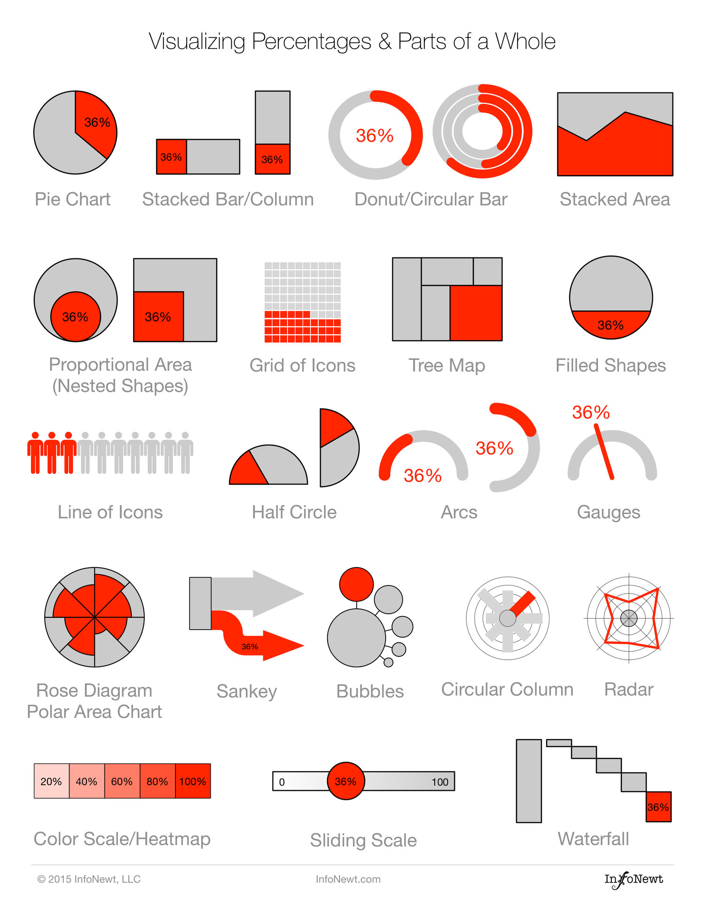
```

## Normas APA para figuras

```{r echo=FALSE, out.width = '30%', fig.align='center'}
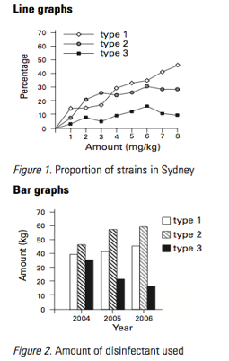
```

## Normas APA para figuras

En el estilo de la APA de cualquier tipo de ilustración que no es una tabla (gráficos, cuadros, dibujos, mapas y fotografas) se llama la figura. Las buenas figuras, deben ser simples y claras.

-   Los números de la figura son arábigos, alineado a la izquierda, en cursiva, por debajo de la figura.
-   El título de la figura escrito al lado del número. Solo use mayúsculas en la primera palabra y en los nombres propios
-   Las etiquetas de los ejes usan mayúsculas en las palabras importantes y una tipografía san serif (por ejemplo, Arial, Helvética).
-   Las etiquetas del eje vertical se alinean verticalmente.

## Normas APA para figuras

En el estilo de la APA de cualquier tipo de ilustración que no es una tabla (gráficos, cuadros, dibujos, mapas y fotografas) se llama la figura. Las buenas figuras, deben ser simples y claras.

-   Las Leyendas están contenidas dentro de los bordes del gráfico.
-   El punto cero se coloca en la ordenada (eje y).
-   Líneas y puntos deben ser claros y nítidos.
-   Las barras usan rellenos distintos para discriminarlos fácilmente
-   Deben especificarse las unidades de medida usadas.

## Gráfico de torta

-   Para variables nominales

-   No permite usar muchas categorías (por congestión visual)

```{r echo=FALSE, out.width = '60%', fig.align='center'}
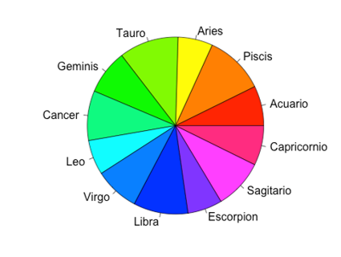
```

## Gráfico de dona

```{r echo=FALSE, out.width = '80%', fig.align='center'}
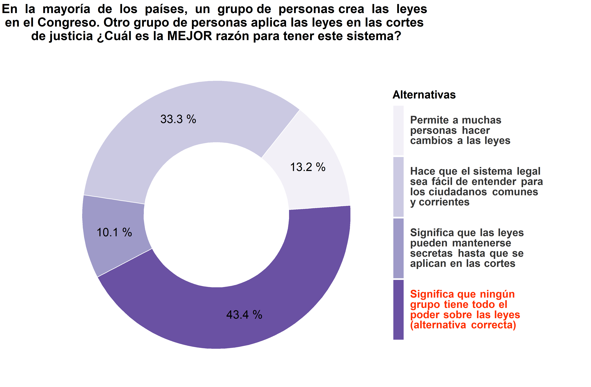
```

## Gráfico de dona

```{r echo=FALSE, out.width = '80%', fig.align='center'}
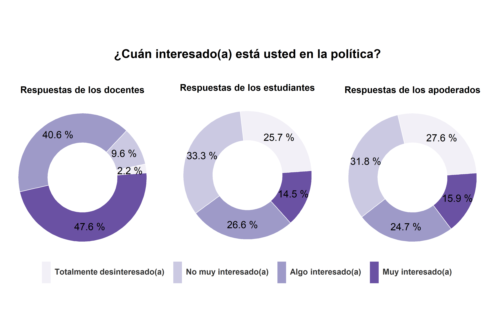
```

## Gráfico de dona

```{r echo=FALSE, out.width = '80%', fig.align='center'}
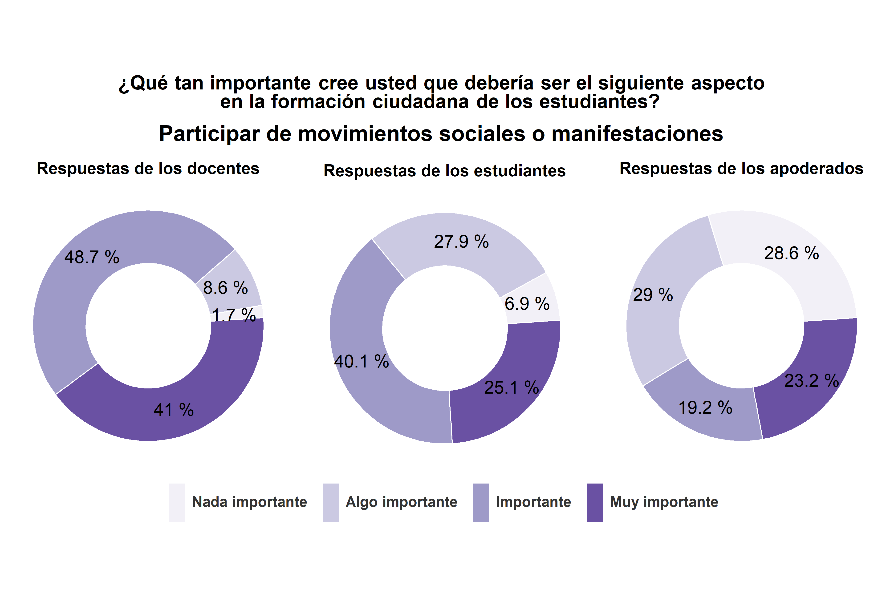
```

## Gráfico de dona

```{r echo=FALSE, out.width = '45%', fig.align='center'}
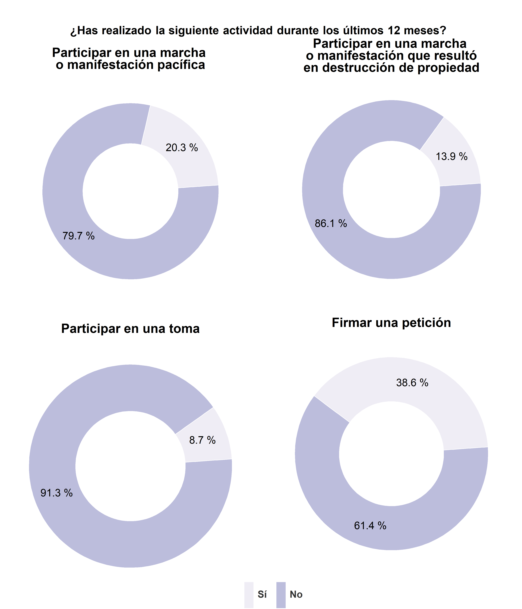
```

## Variables Discretas (nominales, ordinales)

-   No incluye todos los valores dentro de un rango, tiene un conjunto limitado de valores posibles.

-   Por ejemplo, una pregunta likert de 1 a 5, o la cantidad de hermanos que tiene un participante.

```{r echo=FALSE, out.width = '30%', fig.align='center'}
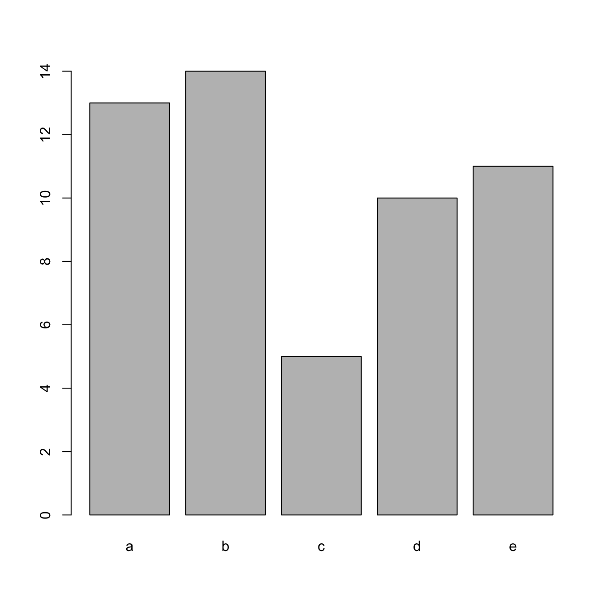
```

## Variables Continuas (intervalo o razón)

-   Incluye todos los valores posibles dentro de un rango. Esto no es comón en ciencias sociales, pero en la práctica cuando tenemos una gran cantidad de valores posibles es mejor tratarlos como continuos.

-   Por ejemplo, el promedio de varias pregunta likert de 1 a 5, tiempos de reacción, puntaje en una prueba

```{r echo=FALSE, out.width = '55%', fig.align='center'}
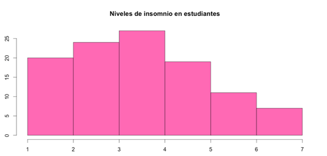
```

## Datos acumulados

Al hacer una tabla de frecuencia de una variable continua surge un problema:

```{r echo=FALSE, out.width = '80%', fig.align='center'}
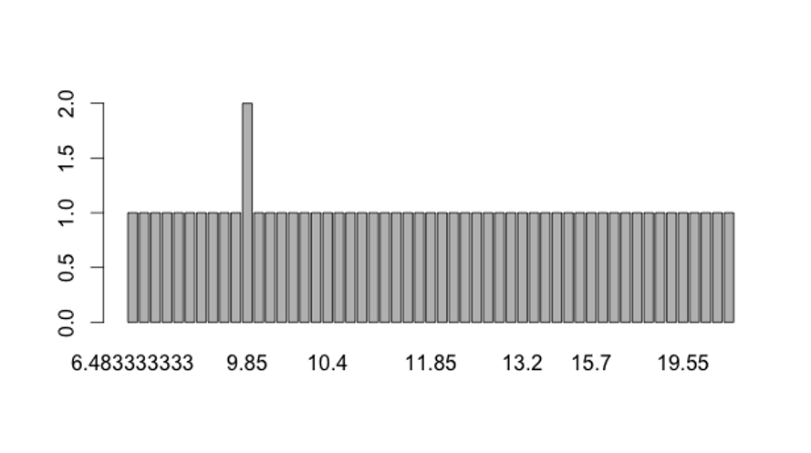
```

## Generación de intervalos

-   Sirven para evaluar la Distribución de una variable continua.

    -   Las variables pueden ser discretas (cantidad de risas) o continuas (proporción de tiempo riendo). En la práctica, si hay muchos valores posibles (ej. 100) es mejor considerarla como continua.

-   Recodifican la variable continua para que tenga menos valores posibles.

-   Hay que construir suficientes intervalos para poder aproximar una curva; pero no muchos, o vamos a tener el mismo problema que en la tabla de frecuencia.

## Histograma

-   Gráfico de una tabla de intervalos

-   Ideal para visualizar la Distribución de la variable continua

```{r echo=FALSE, out.width = '40%', fig.align='center'}
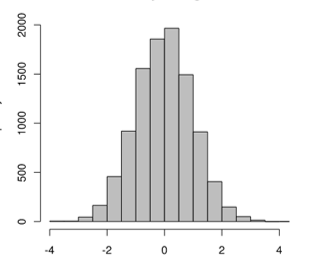
```

## Gráfico de barras vs histograma

```{r echo=FALSE, out.width = '80%', fig.align='center'}
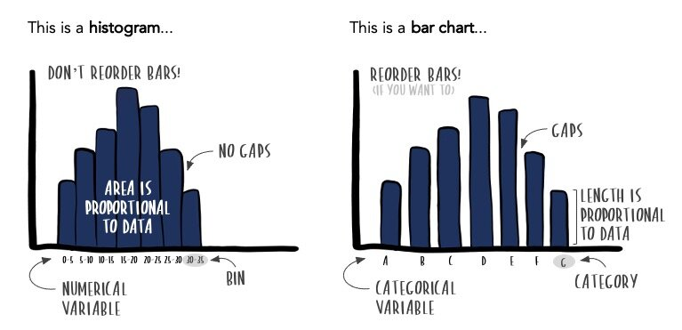
```

**Note:** https://www.storytellingwithdata.com/blog/2021/1/28/histograms-and-bar-charts

## Modelos estadísticos: simplificando el mundo

-   Las tablas de frecuencia (y sus gráficos) incluyen toda la información en la base de datos.

-   Los histogramas pierden información, pero es una pérdida útil ya que permiten entender el fenómeno de mejor manera.

-   En general esto se aplica para todos los indicadores estadísticos.

## Pero existen muchos otros gráficos o figuras mas complejos!!

```{r echo=FALSE, out.width = '50%', fig.align='center'}
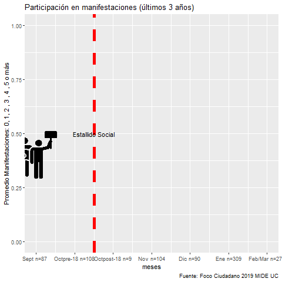
```

## Pero existen muchos otros gráficos o figuras mas complejos!!

```{r echo=FALSE, out.width = '70%', fig.align='center'}
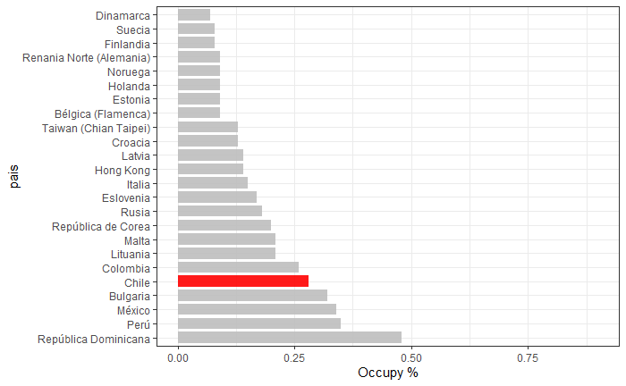
```

## Pero existen muchos otros gráficos o figuras mas complejos!!

```{r echo=FALSE, out.width = '70%', fig.align='center'}
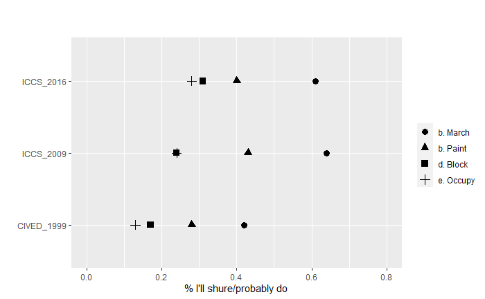
```

## Pero existen muchos otros gráficos o figuras mas complejos!!

```{r echo=FALSE, out.width = '50%', fig.align='center'}
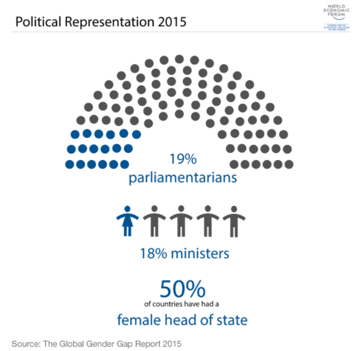
```

## Pero existen muchos otros gráficos o figuras mas complejos!!

```{r echo=FALSE, out.width = '50%', fig.align='center'}
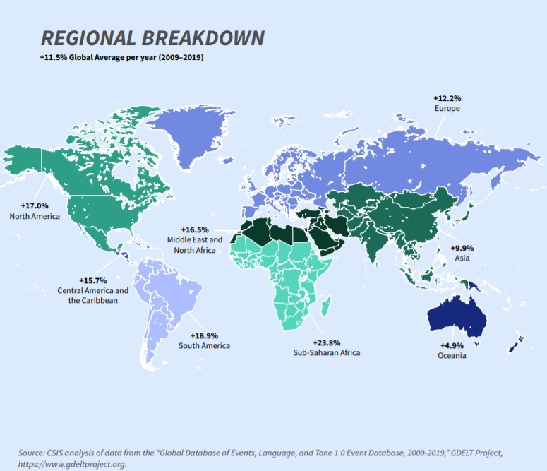
```

## Pero existen muchos otros gráficos o figuras mas complejos!!

```{r echo=FALSE, out.width = '80%', fig.align='center'}
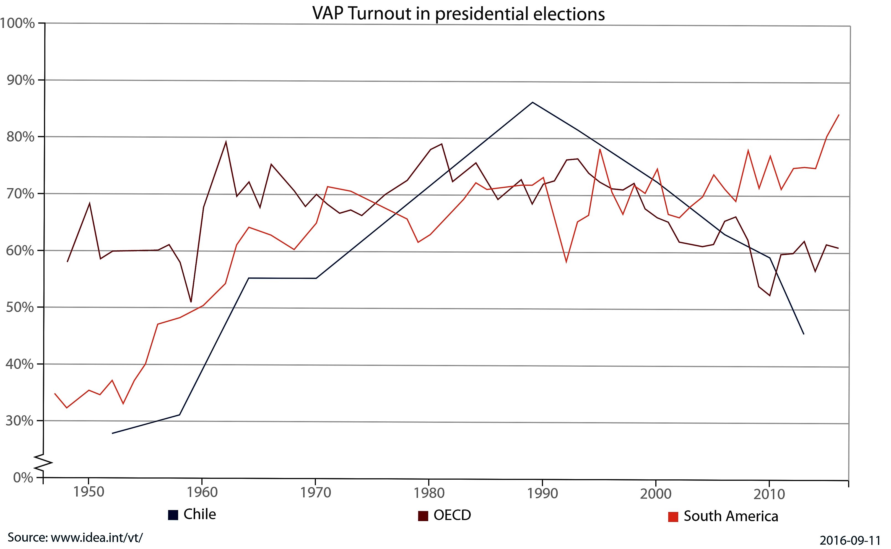
```
